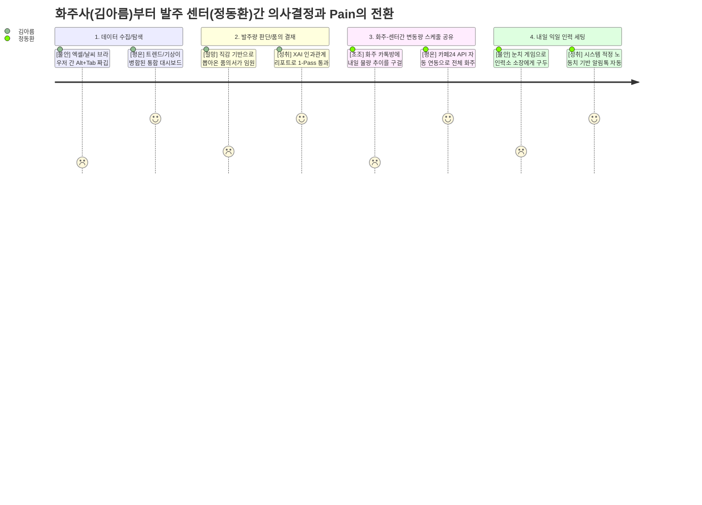
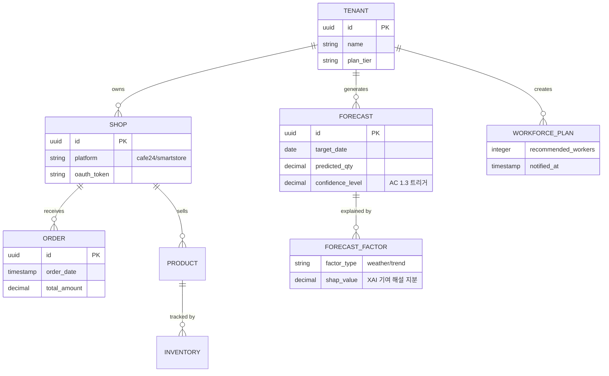
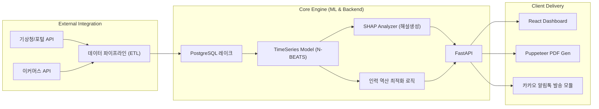

# B2B 수요예측 AI SaaS — 제품 요구사항 명세서 (PRD v1.1)

- **Owner:** Product & AI Engineering
- **문서 버전:** v1.1 (Action Plan 기반 리팩토링본)
- **최종 업데이트:** 2026-04-18
- **문서 상태:** Draft

> 본 문서는 B2B 고객사(이커머스 및 3PL SME)의 의사결정 프로세스를 지원하기 위한 AI 기반 수요예측 SaaS의 요구사항을 명세합니다. **바이오 콜드체인(IoT 관제) 시나리오는 극단적 프리미엄 니치로 판명되어 제품 집중도를 위해 전면 배제(Out of Scope) 되었습니다.**

---

## 1. 개요·목표

### 1-1. 문제 정의 (Pain 지표 포함)

**시장의 구조적 모순 (The Paradox)**
전 세계적으로 AI 솔루션이 범람하지만, 정작 국내 50~100억 매출 규모의 이커머스 SME 실무자 90% 이상은 **여전히 수기 엑셀과 직감에 의존하여 결품 및 재고를 관리**합니다. 대형 SCM 솔루션은 초기 도입 비용이 크고 거대한 변화를 요구해 SME에겐 넘을 수 없는 벽입니다. 체감 고통(AOS)이 매우 높으나 시장의 대안이 비어있는 이 공간에서, 매일같이 뼈아픈 재무적 기회손실이 누수되고 있습니다.

**해결하고자 하는 본질적 Pain & Anxiety**
우리의 솔루션은 단순한 수치 계산기를 넘어, 투명한 데이터 근거(XAI)를 제공해 경영진 결재 반려율을 낮춰 주는 **"이커머스 MD의 직장 생활 안전망"**이자 3PL의 **"인건비 낭비 방어벽"**으로 작동합니다. 대규모 범용 시장(SAP/Oracle 등)에서 정면 승부하는 대신, 압도적인 '결품 방어 및 인건비 옵티마이징' 니치 환경에 집중 타겟팅합니다.

| 페르소나 | Pain 항목 | 실패 지표 (As-Is) | 기회 손실 규모 |
|---|---|---|---|
| **김아름** (이커머스 MD) | 직감 기반 발주/엑셀 수작업으로 인한 결재 반려 및 외적 변수 예측 실패 (품절) | 월 품의 반려 5회, 결품률 15% | 잔여 기회손실액 월 2,500만 원, 야근 4시간 |
| **정동환** (3PL 센터장) | 화주사 기습 프로모션 은폐로 인한 출고 알바 인력 오버스케줄링 적자 | 잉여 알바 오차율 20% | 일 잉여 인건비 80만 원 |

### 1-2. 제품 원칙 및 의사결정 게이트 (Decision Gate)
제품 확장과 기능 결정 과정에서 다음 세 가지 제품 원칙을 반드시 준수합니다. 이 원칙에 2가지 이상 위배되는 기능 요구는 기각(Reject)됩니다.
1. **기술보다 '보고/실무' 우선**: "AI의 예측 정확도"보다 "대표님이 결재해주기 편한 문서(PDF) 형태의 설득력"이 더 중요하다.
2. **복잡도 제로 (Add-on 기생 전략)**: 커다란 새로운 대시보드를 학습시키지 않는다. 쇼핑몰 플랫폼 통합(1-Click) 기반의 백그라운드 구동을 지향한다.
3. **가시적인 비용 방어 원칙**: 도입 ROI를 즉시 증명할 수 없는 모호한 통합 기능은 만들지 않는다.

### 1-3. 시장 규모 (TAM / SAM / Target SOM)

| 구분 | 시장 정의 | 규모 | 근거 |
|---|---|---|---|
| **TAM** | 글로벌 AI 수요예측 소프트웨어 시장 | **약 1조 1,100억 원** | FMI 글로벌 통계 |
| **SAM** | 클라우드/SaaS형 수요예측 시장 | **약 7,300억 원** | TAM × 66% |
| **Target SOM** | 국내 이커머스/물류 SME SaaS (1년 차 타겟) | **약 18~20억 원** | 글로벌+국내 대상 시장 중 이커머스 비중 필터링 |

### 1-4. 목표 (North Star KPI - Leading Metrics 전환)

| KPI (선행형 북극성 지표) | 측정 기준 및 도구 (Query/Event) | 목표값 |
|---|---|---|
| **권장 리포트 1-Pass 통과율** | XAI 시스템이 만들어준 수치가 경영진을 무수정으로 통과했는가? | **≥ 80% 통과** |
| **발주량 무수정 채택 비율** | 시스템이 뽑아준 값을 사용자가 신뢰하여 수정 없이 내보내는 비중 (Edited=false) | **≥ 80%** |
| **적정 인원 통보 반영률** | 알림을 받은 센터장이 오차 범위 내에서만 인력을 콜업하는가? | 오차율 **≤ 5%** |

---

## 2. 사용자와 페르소나

### 2-1. 핵심 페르소나 (Core Target)
*   **👩‍💼 김아름 (36세, 코스메틱 MD):** 
    "날씨 엑셀 합치다가 컴퓨터 꺼지면 다 때려치우고 싶어요." 네이버 트렌드와 기상청을 수동 대조하다가 상사에게 직감을 의심받는 실무자. AI가 권장 발주량을 논리적으로 해설해주어 자신이 질 독박 책임을 대신 져주길 바람.
*   **👷‍♂️ 정동환 (45세, 3PL 물류센터장):** 
    "답장 없는 얌체 화주들, 알바생 허공에 쓴 인건비 어떻게 하나요." 화주사의 쇼핑몰 API를 1-Click 플랫폼으로 당겨와, 내일 출근할 정확한 일용직 노동자의 숫자를 오차 없이 파악하고 적자(일 80만 원)를 막고자 함.

### 2-2. 사용자 여정 맵 (As-Is vs To-Be CJM)

---

## 3. 사용자 스토리와 수용 기준 (AC)

> 예외 처리에 집중한 네거티브 AC(Failure Path)를 철저히 시스템에 반영합니다.

### Story 1: 결재 방어용 날씨/트렌드 융합 XAI 리포트 추출

> **As a** 이커머스 MD (김아름),
> **I want** 기상/트렌드 등 외부 변수가 정량화된 XAI 권장 발주 리포트를 추출하여,
> **So that** 경영진 결재를 1번 만에 통과시키고 독박 책임에 대한 심리적 면책을 받을 수 있다.

| AC # | 유형 | 내용 (Given - When - Then) |
|---|---|---|
| **AC 1.1** | Happy | 시스템 예측 도출 시 가장 크게 기여한 외부 파라미터 Top 3가 **Shapley 기반 텍스트(XAI)로 치환**되어 표기된다. |
| **AC 1.2** | Happy | PDF 다운로드 시, **기존 회사의 보수적인 엑셀 품의서 레이아웃을 해치지 않는 호환 포맷**으로 출력된다. |
| **AC 1.3** | **Exception** | 내부 연산 결과 **예측 신뢰도 구간(Confidence)이 70% 미만**으로 하락하거나 결측값이 감지될 경우, 발주 버튼 상단에 **[주의: AI 신뢰도가 낮습니다. 사람이 수동으로 수치를 점검하세요]** 경고 배너를 노출하여 사고를 방지한다. |
| **AC 1.4** | **Exception** | 외부 기상청 API 데이터 타임아웃 발생 시, 캐시 데이터를 활용하되 **"금일 실시간 데이터 지연. 어제 기준 수치 반영"**이라는 엠블럼을 출력물에 박아 넣는다. |

### Story 2: 파트너 화주 연동 및 인력 자동 스케줄링 대시보드

> **As a** 3PL 물류센터장 (정동환),
> **I want** 화주사들의 쇼핑몰 데이터를 우리 센터 대시보드와 자동 연동하여 합산하고,
> **So that** 출고 물량 예측 실패로 인한 오버 스케줄링(인건비 낭비) 사태를 차단하고 싶다.

| AC # | 유형 | 내용 (Given - When - Then) |
|---|---|---|
| **AC 2.1** | Happy | 화주사 추가 온보딩 시, 개발 지원 없이 오직 **1-Click 형태의 인증(OAuth 등) 방식만으로 연동**이 처리된다. |
| **AC 2.2** | Happy | 익일 출하 예상 합산량에 비례하여 '적정 투입 일용직 인원수'가 역산 도출되고 오후 4시에 자동 알림톡 전송. |
| **AC 2.3** | **Exception** | 특정 화주 API 토큰 만료 시 생존한 데이터만으로 인원을 산출하되 발송 내용에 **[알림: A상사 데이터 연동 끊김 - 수동 계산 가산 요망]** 붉은색 강수 표기를 포함한다. |
| **AC 2.4** | **Exception** | 카카오 시스템 오류로 알림톡 파이프라인 전송 실패 시, 1분 이내 단문 일반 메시지(SMS)로 Fallback 자동 발송을 성공시킨다. |

---

## 4. 기능 요구사항 (Functional Requirements)

### 4-1. MoSCoW 우선순위

| 우선순위 | 기능명 (Feature) | 핵심 가치 및 내용 |
|---|---|---|
| **Must (MVP)** | (F1) 날씨/트렌드 융합 XAI 리포트 추출기 | 딥러닝 예측 + 원인 해설 자연어 엔진(XAI) + 임원용 PDF 출력 모듈 |
| **Must (MVP)** | (F2) 이커머스 쇼핑몰 API 원클릭 통합 모듈 | 물류 센터-화주 간 마찰 없는 마켓 API(카페24 등) 실시간 연동 체계 |
| **Must (MVP)** | (F3) 적정 노동 인원(알바) 통보 대시보드 | 출하 용량(Capacity) 역산식 기반의 적정 인원 도달 및 카카오 알림톡 자동화 발송 |
| **Should** | (F5) 예산 지출 연동 What-IF 시뮬레이터 | 마케터의 예산 제약과 연동한 다중 시나리오 예측 엔진 (Fast Follower 배포) |
| **Could** | (F6) 모바일 신호등(적/녹/황) 초간단 방식 UX | 노안 현장 작업자 접근성을 높이기 위한 극단적 미니멀리즘 대시보드 화면 래핑 |
| **Won't** | (F4) 콜드체인 실시간 노선 재설정기 | **[제외 사유]** 체감 고통(AOS) 4.0으로 기회가 크나, GPS/IoT 하드웨어 연계 난이도로 인해 Add-on SaaS 정체성과 이질적임. **[재진입 조건]** MVP (F1~F3) 런칭 및 궤도 안착 후 프리미엄 티어 확장 시 재검토 |

### 4-2. 경쟁 대안 대비 수치 목표 (Benchmarking Targets)

이 제품이 경쟁 대안들을 압도할 수 있도록 타겟하는 개발 및 서비스 최적화 검증 지표입니다.

| 비교 대상 (기존 대안) | 비교 과업 | 기존 대안 도출 값 | **목표 (우리 솔루션)** | **수치 개선 포인트** |
| --- | --- | --- | --- | --- |
| **수기 엑셀 수집** | 기상 및 변수 수집 / 발주량 도출 소요 시간 | 일 평균 **4시간** | 일 평균 **10분** 이내 | 소요 시간 **95% 단축** |
| **직감 기안서 제출** | 경영진에게 올린 기안서 임원 반려 횟수 | 월 평균 **5회** | 월 **0회** (1-pass) | 결재 오류율 **100% 제거** |
| **대형 SCM/ERP** | 솔루션 초기 도입 소요 기간 및 전환 비용 | 최소 **3개월**, 수억 원 | **당일 반영**, 월간 SaaS 구독 | 도입 장벽 **Zero화** |
| **메신저 구두 소통** | 당일 출고 필요 인원 산정 오류(오버 부킹) | 잉여 손실 일 평균 **80만 원** | 오차율 ±5% 이내, 잔여분 **0원** | 잉여 인건비 **100% 방어** |

### 4-3. Build / Buy / Partner 기술 내재화 원칙

| 기능 파트 | 로드맵 타겟 스택 | 도입 결정 | 핵심 전략 사유 |
|---|---|---|---|
| 모델링 엔진 | 시계열 자체 모델(TFT/앙상블) | **Build** (In-house) | 버티컬 특화 도메인 로직은 외부에 의존 시 경쟁력 소멸(코어 IP화 필수). |
| 문서(PDF) 변환 | Puppeteer 엔진 등 | **Buy** (Open-source) | 보편적인 데이터 레이아웃 출력은 바퀴를 재발명하지 않고 외부 라이브러리 엔진 차용. |
| 알람/알림톡 엔진 | 카카오 비즈 API | **Partner** | B2B 메신저 확장이 아닌 '고객이 이미 쓰는 곳에 매끄럽게 꽂히는' 플러그인 전략 고수. |

### 4-4. 특화 포지셔닝(Niche) 전략
수억 원짜리 범용 SCM 솔루션(SAP, 블루욘더 등)과 직접 경쟁하는 것을 철저히 피합니다. 대형 제조망이 아닌, 정보화의 사각지대에 놓인 '이커머스 SME 및 로컬 3PL 물류창고'라는 극단적인 니치(Niche) 타겟에 파고들어, 무거운 차트 화면 대신 **'결재 프리패스, 비용 0원 방어'**라는 압도적 체감 가치만 송곳처럼 제공합니다.

---

## 5. 비기능 요구사항 (NFR)

### 5-1. 성능 및 신뢰성 타겟
| 카테고리 | 제약/조건 |
|---|---|
| **성능 (Performance)** | XAI 대시보드 리포트 계산/로딩 구동 P95 ≤ 10초 이내 종료.  PDF 생성 완료 시점 응답 기준 P95 ≤ 20초 이내. |
| **신뢰성 (Reliability)** | 코어 서비스의 앱 구동(Uptime) 월 SLA 가용성 ≥ 99.5%.  데이터 파이프라인(ETL) 실패 시 API Limit 등을 감안하여 간격 조율형 3회 자동 재시도 룰 적용. |
| **데이터 결손 대응** | 단일 API 제공사(기상청 등) 분당 Rate Limit 도달 시 즉각적인 배치 큐잉(Queue) Fallback 모드로 전환. |

### 5-2. 보안 및 프라이버시 제한 (Security NFR)
*   **멀티테넌트 격리 단위:** SaaS 특성상 비용 방어를 위해 논리적 멀티테넌시 데이터베이스 아키텍처를 취하되, 보안 스키마 분리와 JWT 기반의 엄격한 Role 분리 보안 토큰(인가) 규칙을 철저히 설계한다. 화주사 간의 교차 노출 사고는 절대 금지 권한 구역 내 존재한다.

### 5-3. 모니터링 및 온콜(On-Call) 기준

| 모니터링 대상 | 도구 | 알림 기준 | 대응 |
|---|---|---|---|
| **인프라 / APM** | AWS CloudWatch + Datadog | CPU > 80% (5분 지속), 메모리 > 85%, 5xx 에러율 > 1% | Slack 경고 → PagerDuty 온콜 호출 |
| **데이터 파이프라인 (ETL)** | Airflow DAG 모니터링 | DAG 실패 즉시 또는 3회 연속 지연/실패 시 | Slack #alert-pipeline → 백엔드 P1 대응 |
| **모델 성능 드리프트** | 커스텀 대시보드 | MAPE > 초기 기준선 + 10%p 시 재학습 트리거 | AI 엔지니어 팀 알럿 → 분기 재캘리브레이션 |
| **비즈니스 KPI** | Amplitude / Recharts 대시보드 | 결재 반려 발생 시 즉시 / 인건비 절감률 < 20% 시 주간 알림 | 제품팀 주간 리뷰 연동 |

---

## 6. 데이터·인터페이스 개요 (Data & Architecture)

### 6-1. 핵심 시스템 엔터티 / ERD 

### 6-2. 기술 아키텍처 개요 다이어그램

---

## 7. 범위(Scope), 리스크 및 ADR

### 7-1. In Scope / Out of Scope

개발 스코프의 폭주를 막기 위해 명확한 선을 긋습니다.

| 속성 | 대상 및 한계 |
|---|---|
| **In Scope** | 사용자 온보딩 및 회원가입, 카페24/스마트스토어 플러그인 1-Click 연동 모듈, 대시보드 화면(웹), XAI 해설 로직 기반 예측 모델 배포 및 PDF 리포트 다운로드, 출고 캐파 역산 기반의 노동력(근로자 수) 알림톡 전파 |
| **Out of Scope** | 자동 거래/서플라이 체인 주문 즉시 배달 자동화 연동(타 서버로 쓰기 제어 금지), 커뮤니티 게시판 / 포럼 구성, (F4) 콜드체인 실시간 차량 GPS 추적 및 노선 지도 재설정기 (V1.1 배포 범위에서 절대 금지) |

### 7-2. 주요 리스크 (Risk) 및 대처 규정
*   **[R1. 타사 API 연동 거부감]** : 화주사들이 자신들의 귀중한 마켓/매출 데이터를 타 플랫폼(3PL용 SaaS)에 개방하는 것에 보안 거부감을 나타낼 수 있음.
    *   *전략적 우회:* "연동해주면 택배 지연 시 발생하는 위약금을 우리가 모두 막아 드립니다"는 역 마케팅 전개 및 개발 부담 제로의 원클릭 온보딩(OAuth 인증형) 강조.
*   **[R2. 초기 데이터 가뭄]** : 콜드스타트(초기 설치) 시 고객 측의 누적 과거 이력 데이터가 빈약하여 AI 엔진의 품질이 엉망일 수 있음.
    *   *전략적 우회:* 사전 구축된 범용 웨이트 기반 전이학습(Transfer Learning) 적용 구동. 또한 신뢰도가 낮게 뜰 경우 무너진 값을 숨기지 않고 철저하게 Warning AC 1.3을 발동해 솔직한 안내를 띄움.

### 7-3. 제품 전제 가정 (Assumptions)
*   카페24·스마트스토어 등 메이저 쇼핑몰 플랫폼의 OAuth 인증 프로세스는 큰 기술적/정책적 거절 없이 현재 API 스펙대로 **최소 12개월** 유지될 것이다.
*   기상청 단기예보 API의 무료 이용(일 1,000회)이 MVP 기간 동안 유지되며, 배치 큐잉으로 Rate Limit을 초과하지 않게 제어 가능하다.
*   파일럿 고객 **2사**가 Sprint 3(Phase 3) 시작 전까지 확보 가능하다. *(실험 설계 §8-2의 전제 조건)*
*   AWS 스타트업 크레딧 활용으로 MVP 기간 동안 인프라 비용을 자체 부담 없이 월 500만 원 이내로 운영 가능하다. *(NFR §5-1 비용 제약 근거)*

### 7-4. 시스템 의존성 (Dependencies)
*   **(F3 → F2 종속):** 알바 인원 역산 통보 알고리즘(F3)은 사전에 이커머스 매출 데이터 API 연동(F2)이 정상적으로 선행 결합되어야만 성립된다.
*   인과성 해설(XAI)의 한국어 렌더링 결과물 품질은 LLM 서머라이저의 한국어 경영진 톤 조정 성능에 의존한다.
*   PDF 리포트 양식은 파일럿 고객의 **기존 결재 양식을 수집한 후 확정**된다. *(Story 1 AC 1.2의 선행 조건)*

### 7-5. ADR (Architecture Decision Record) 핵심 요약
*   **ADR-01. MLaaS 버림 및 자체 통합망 유지:** AWS Forecast와 같은 관리형 MLaaS 클라우드를 버리고 자체 시계열 엔진을 구축하는 이유는 "SHAP 커스텀 변수 추출 등 윗선을 설득하기 위한 XAI 해설 능력의 자유로운 극대화"를 이뤄내기 위한 목적임을 재천명.
*   **ADR-02. 복잡한 엑셀 엔진 대신 PDF 차용:** 보수적인 조직 내 문서 반입을 위해 웹뷰 UI 차트를 Puppeteer를 통해 원본 감성 그대로 A4 용지처럼 강제 캡처 렌더링.

---

## 8. 실험 설계 및 롤아웃(배포) 계획

### 8-1. 롤아웃 로드맵 (Phase별 배포 계획)

`06_VPS`에서 합의된 구체적인 MVP 런칭 기간(12주. Sprint 1~3) 타임라인입니다.

*   **Phase 1 — 데이터 파이프라인 통합 (Sprint 1 · 4주)**
    *   목표: 내/외부 데이터 파이프라인 ETL 구축.
    *   결과물: 기상청 수집 파이프라인, **카페24 등 1-click 연동 커넥터(F2 완료)**.
*   **Phase 2 — 코어 엔진 및 XAI 모듈 조립 (Sprint 2 · 4주)**
    *   목표: 예측 모델 및 해설 자연어 생성.
    *   결과물: 시계열 예측 엔진, **SHAP 기반 XAI 엔진 구축 완료. 적정 인원 역산 통계 모델 수립(F3 뼈대)**.
*   **Phase 3 — UI 프론트엔드 조립 및 PoC 검증 (Sprint 3 · 4주)**
    *   목표: 사용자 대시보드 렌더링 및 파일럿 고객(2~3사 대상) 피드백 취합.
    *   결과물: 대시보드 인터페이스, **대표님 프리패스용 PDF 다운로더 완료, 카카오 알림톡(F3 완료)**.

### 8-2. 파일럿 검증 기준 (A/B Test)

| 실험 목적 | 대상 페르소나 | 통계적 실험 설계 (A/B Test Design) | 판정 기준 (Hit Threshold) |
|---|---|---|---|
| **결재 승인 소요 시간 단축 증명** | 김아름 (MD) | **대응 표본 T-검정**  • n = 사내 4개 고객사 실제 품의 (30회)  • 비교 = 엑셀 작성 구두 품의 vs PDF XAI 자동 도출 품의 소요 시간 | p < 0.05 레벨에서 XAI 작성 제출 품의 시간이 과거 통상 평균 대비 월등히 가속도 입증 됨. |
| **물류 잉여 비용 절감 증명** | 정동환 (센터장) | **대응 표본 T-검정**  • n = 파일럿 적용 창고의 최소 21 영업일 관찰 | 구두 취합 기반 잉여 낭비 임금 (일 80만) 대비 솔루션 사용구간 간극 10%p 이상 소멸 확증. |

---

## 9. 근거 (Proof)

지금까지 정의된 핵심 Pain(고통결여)과 이를 대응하는 To-Be 전략이 단지 상상 속 제안이 아니라, 실제 치열했던 B2B JTBD(Jobs-to-be-Done) 인터뷰와 검증에서 발췌된 실증 증거입니다.

*   **"날씨 엑셀 하나로 합치다 컴다운되면... 아 그냥 다 때려치고 싶다니까요."** (MD 김아름) 
    → _AC 1.1 및 결품 방어 가설 도출의 원인 인터뷰_
*   **"제 직관력과 감은 훌륭하지만... 임원들이 안 믿습니다."** (MD 김아름)
    → _ADR-01. 범용 ML 버리고 XAI 결재 리포트 기능을 메인 가치로 잡게 된 결정적 이유_
*   **"화주 이놈들은 물건 팔 땐 말 안 해주고, 배송 지연되면 우리한테 위약금 내놓으래요. 매일 밤 10시에 카톡 돌리는 게 제 일입니다."** (3PL 정동환) 
    → _AC 2.1 (API 연동) 및 메신저 구두 소통 제거(알람톡 자동화)를 핵심 벤치마크/KPI로 고정한 동력 배경_

*(End of PRD Document - v1.1)*
