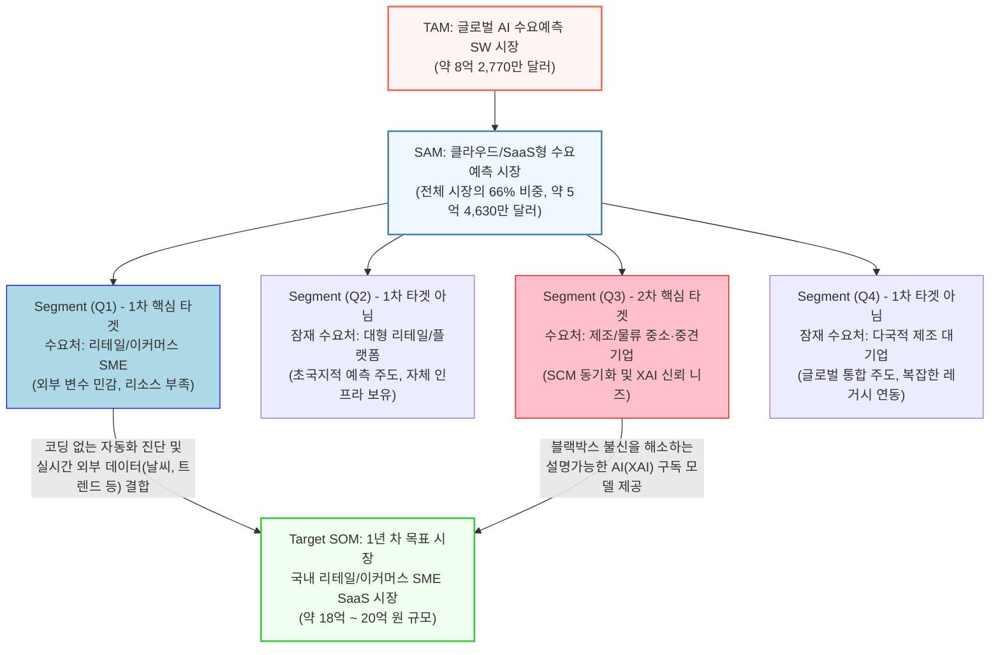

# 06_시장_규모_세분화_종합

# TAM-SAM-SOM 시장 산출표

---

### 📊 1. B2B 수요예측 AI SaaS 솔루션 TAM-SAM-SOM 시장 산출표

| **구분** | **시장 정의** | **시장 규모 (계산식)** | **근거 자료** |
| :--- | :--- | :--- | :--- |
| **TAM** (전체 시장) | **글로벌 AI 수요예측 소프트웨어 시장** B2B AI 솔루션이 접근할 수 있는 수요예측 특화 소프트웨어 전체 파이 | **약 8억 2,770만 달러** (약 1조 1,100억 원) | Future Market Insights(FMI)의 2025년 글로벌 AI 수요예측 SW 시장 규모 통계 |
| **SAM** (유효 시장) | **글로벌 클라우드/SaaS형 수요예측 AI 시장** 구축형(On-premise)을 제외한, 당사의 배포 방식인 '온라인/클라우드 기반' 유효 시장 | **약 5억 4,630만 달러** (약 7,300억 원)  *(계산식: TAM $8.27억 × 클라우드 기반 솔루션 비중 66%)* | FMI 보고서 내 클라우드 기반 솔루션(SaaS 플랫폼, API 통합) 매출 비중(66%) 적용 |
| **SOM** (수익 시장) | **글로벌 및 국내 SME 대상 SaaS 수요예측 시장** 초기 자본/전문 인력이 부족해 구독형 SaaS를 즉각 도입할 '중소기업/스타트업(SME)' 타겟 시장 | **[글로벌] 약 2억 3,490만 달러** *(계산식: SAM $5.46억 × SME 비중 43%)*  **[국 내] 최소 400만 달러 (약 54억 원)** *(계산식: 글로벌 SOM × 한국 AI SW 평균 점유율 약 1.7%)* | FMI 보고서 내 SME(중소기업) 구축 비중(43%) 적용 |
| **Target SOM** (1년차 목표) | **국내 리테일/이커머스 SME SaaS 시장** 외부 변수 민감도가 가장 높아(Q1 그룹) 1년 차에 최우선 공략할 국내 이커머스/리테일 타겟 파이 | **약 140만 달러** **(약 18억 ~ 20억 원)**  *(계산식: 전체 SOM 중 이커머스/리테일 차지 비중 약 35% 교차 적용)* | 글로벌 AI 영업/수요예측 시장 내 리테일/이커머스 점유율 및 수요예측 비중 통계 활용 |

---

**💡 산출표 핵심 시사점**
*   **보수적 추정(Conservative Estimation):** 위 산출표는 지나치게 부풀려진 전체 AI 시장이 아닌, 정확히 **'AI 수요예측 소프트웨어(AI Demand Forecasting Software)'**라는 좁고 구체적인 범주의 글로벌 통계를 기반으로 계산되어 높은 신뢰도를 제공합니다.
*   **1년 차 현실적 점유 목표:** Target SOM으로 산출된 국내 이커머스 SME 시장(약 20억 원) 중, **1년 차 영업 목표를 5~10% 수준(약 1억~2억 원, 초기 레퍼런스 고객 10~20곳)**으로 설정하여 현실적인 가설 검증이 가능합니다.

---

이 다이어그램은 전체 시장(TAM)에서 유효 시장(SAM)으로, 그리고 우리가 실제로 공략할 타겟 고객층(Q1, Q3)을 거쳐 최종적인 1년 차 목표 시장(SOM)으로 이어지는 흐름을 직관적으로 보여줍니다.

---

### 📊 2. B2B 수요예측 AI SaaS 솔루션 Market Segment Map (Mermaid 시각화)

#### 💡 시각화 차트 구성 근거 (보고서 첨부용 설명)
*   **TAM & SAM 도출:** 글로벌 AI 수요예측 소프트웨어 시장은 약 8억 2,770만 달러 규모이며, 이 중 초기 구축 비용 장벽을 낮춘 클라우드 기반(SaaS) 솔루션이 66%의 비중을 차지하여 주요 유효 시장(SAM)을 형성하고 있습니다.
*   **Segment 분류 (Q1~Q4):** 시장의 43%를 차지하는 중소기업(SME) 타겟을 1·2차 타겟으로 설정했습니다. 이 중에서도 외부 변수에 민감하고 당일 배송 등 초국지적 예측 니즈가 폭발적으로 증가하는 리테일 및 이커머스 산업군(Q1)을 1년 차 핵심 타겟으로 잡았습니다. 제조 및 물류(Q3) 분야 역시 35%의 큰 비중을 차지하나, 설명 가능한 AI(XAI)에 대한 신뢰 확보 단계가 필요해 2차 확장 타겟으로 배치했습니다.
*   **Target SOM:** 1년 차 목표인 Q1 국내 시장은 한국의 AI SW 점유율과 이커머스 비중을 고려해 약 20억 원 규모로 추산하였으며, 이 중 5~10% 수준의 점유를 단기 목표로 설정하여 시장 진입을 추진합니다.

---

