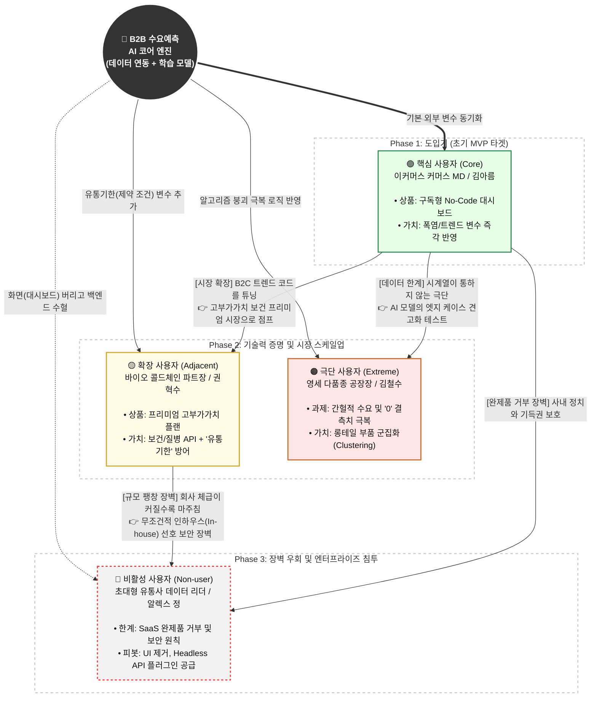

# 07_페르소나_정의_종합

# B2B 수요예측 AI SaaS솔루션: 페르소나 스펙트럼 (Persona Spectrum)

시장 세분화(Market Segmentation) 분석 결과를 바탕으로, B2B 수요예측 AI SaaS 솔루션과 직·간접적으로 닿아있는 **총 12명의 페르소나 스펙트럼**을 핵심, 확장, 극단, 비활성 4가지 유형으로 세분화하였습니다.

---

## 🟢 1. 핵심 사용자 (Core Users) - 5명
**[목적: 매출 및 사용 빈도 중심의 이상적인 주력 타깃 (Q1, Q3 그룹 위주)]**

### 1) 김아름 (32세) / 코스메틱 이커머스 쇼핑몰 메인 MD
* **직무:** 트렌드 변동이 심한 뷰티 카테고리의 상품 소싱 및 일일 발주량 결정
* **문제:** 뷰티 유튜버 발언 하나에 수요가 급등락함. 과거 엑셀 데이터로는 예측이 불가능해 매번 품절 대란이 일어나 기회 손실이 막심함.
* **목표:** 날씨, 소셜 트렌드, 자사 프로모션 일정 등 외부 변수를 종합하여, 상품별로 단기(1주일) 발주 권장량을 정확하게 추천받는 것.
* **감정:** 압박감, 불안함 ("또 품절나서 항의 들어오면 어떡하지?")
* **대체 솔루션:** 엑셀 기반 수기 계산 + MD 본인의 감에 의존 + 네이버 트렌드 등 포털 검색어 수동 확인

### 2) 박현우 (41세) / 중견 부품 제조기업 SCM(공급망 관리) 팀장
* **직무:** 글로벌 원자재 수급 일정 관리 및 월간/분기간 공장 가동률 최적화를 위한 생산 계획 수립
* **문제:** 글로벌 해운비용 변동 및 환율 등으로 원자재 리드타임이 불규칙함. AI 예측 결과를 실무진과 보수적인 임원들에게 설득하려면 명확한 근거(XAI)가 필요함.
* **목표:** 납기 지연을 막고 리스크를 분산하기 위해 투명하고 인과관계가 명확하게 설명되는 'AI 수요예측 대시보드'를 확보하는 것.
* **감정:** 피로함, 높은 책임감 ("수십억짜리 발주인데 'AI가 그랬다'고 어떻게 보고하나?")
* **대체 솔루션:** 구형 SAP 시스템의 하드코딩된 기초 수요예측 모듈 분석

### 3) 이진수 (38세) / F&B 프랜차이즈 본사 물류/재고 파트장
* **직무:** 전국 가맹점 대상 식자재 수요 예측 및 일일 물류 창고 채분 배분
* **문제:** 각 매장이 위치한 상권 이벤트나 국지적 폭우/폭설에 따라 가맹점별 수요가 극명하게 갈려 폐기율이 너무 높음.
* **목표:** 초국지적(Hyper-local) 기상 데이터와 상권 분석이 결합된 권장 재고량을 매장별로 자동 산출하여 전체 폐기 비용을 30% 이상 절감.
* **감정:** 아쉬움, 번거로움 ("본사 차원에서 가맹점별로 디테일하게 챙겨주기엔 인력이 너무 모자라")
* **대체 솔루션:** POS 데이터 기반 과거 4주 차 동일 요일 평균치 단순 적용

### 4) 최유진 (29세) / 온라인 패션 편집숍 퍼포먼스 마케터
* **직무:** 메타/구글 광고 예산 집행 및 프로모션별 기대 유입/전환/수요 예측
* **문제:** 광고 예산을 늘렸을 때 재고가 얼마나 더 빨리 소진될지 정확한 인과관계 파악이 어려워, 항상 마케팅과 재고 팀 간에 마찰이 발생함.
* **목표:** 마케팅 지출액과 특정 전환율을 변수로 입력했을 때, 그것이 재고 소진 속도에 미치는 영향을 시뮬레이션(What-If 분석) 해주는 솔루션 도입.
* **감정:** 답답함, 갈등 ("광고 효율이 대박 났는데 재고가 없다는 게 말이 되나요?")
* **대체 솔루션:** 구글 애널리틱스(GA) 트래픽 전환율과 사내 재고 DB를 수동으로 교차 대조

### 5) 정동환 (45세) / 중소형 물류대행 (3PL/ fulfillment) 센터장
* **직무:** 다양한 화주(고객사)들의 입/출고 물동량 처리 스케줄 및 인력 근무표 작성
* **문제:** 화주들마다 프로모션 일정이 중구난방임. 내일 물동량이 얼마나 터질지 몰라 항상 용역 알바 인력을 과잉으로 부르거나 모자라게 부름.
* **목표:** 각 화주사들의 과거 취급 데이터와 트렌드 지표를 연동해 '단기 센터 출고량'을 예측하고, 이에 맞춰 정확한 창고 인력(TO)을 배치하는 것.
* **감정:** 스트레스, 재무적 손실 우려 ("오늘도 알바 10명이 그냥 놀았네. 까먹은 인건비가 얼마야..")
* **대체 솔루션:** 화주사 MD들과 매일 오후 4시에 수동으로 카톡/전화 소통하여 익일 특이사항 취합

---

## 🟡 2. 확장 사용자 (Adjacent Users) - 3명
**[목적: 유사 문제를 가진 인접 시장군으로의 확장 기회 탐색]**

### 1) 권혁수 (31세) / 제약/바이오 중소 유통사 콜드체인 담당자
* **직무:** 온도 제한 및 유통기한이 짧은 백신/의약품 재고 배분 및 소진 전략 수립
* **문제:** 의약품은 수요예측이 한 번만 틀려도 기한 만료로 전량 폐기해야 하는 리스크가 엄청나지만, 날씨와 유행병 트렌드 파악이 엑셀로는 안됨.
* **목표:** 지역별 질병 유행 데이터나 기온 변화를 선행 지표로 삼아 의료기기/의약품의 '지역 분포 플래닝'을 자동화.
* **감정:** 극도의 긴장감, 리스크 최소화 강박 ("이건 유통기한 넘기면 바로 수천만 원 손실이야")
* **대체 솔루션:** 질병관리청 주간 발표 자료 수동 모니터링 및 보수적인 재고 보유

### 2) 송미란 (36세) / 식자재 B2B 유통망 영업팀장
* **직무:** 식당/기업 급식소 거래처별로 주문량을 예측하고 사전 발주량 확보
* **문제:** B2C 타겟팅 수요예측 툴은 많지만, B2B 거래처 간의 주문 패턴 변동성을 예측해 주는 시스템은 찾기 어려움.
* **목표:** 기업들의 근로 형태 변화(재택근무 등) 요인을 반영하여 대규모 식자재 공급 예측의 오차를 줄이기.
* **감정:** 한계를 느낌, 고립감 ("B2C 데이터 중심 AI는 우리 비즈니스랑 핀트가 안 맞아")
* **대체 솔루션:** 영업사원들의 개별적인 주관 및 단골 거래처와의 구두 약속(관계형 영업)

### 3) 이유리 (28세) / 공간 대여 및 오프라인 팝업스토어 기획자
* **직무:** 특정 상권 내 팝업스토어 단기(1주~1달) 임대 수요 및 트래픽 예측
* **문제:** 재고물품이 아닌 '공간과 시간'을 파는 직무. 해당 지역의 주말 날씨, 대체 공휴일 등에 따라 공간 임대율 차이가 막심함.
* **목표:** 상품 기반이 아닌 시간/공간(서비스형 수요) 기반의 트래픽을 예측하여, 빈 시간대(Idle time)에 다이나믹 프라이싱(할인)을 적용하는 것.
* **감정:** 막막함, 데이터 갈증 ("이 상권 이번 주말에 사람 얼마나 올지 미리 알 수 없을까?")
* **대체 솔루션:** 호갱노노, 네이버 지도 상권 데이터, 엑셀 과거 공실률 기록

---

## 🟠 3. 극단 사용자 (Extreme Users) - 2명
**[목적: 기술의 제약/극단적 상황을 가져 포용적 설계 및 제품 고도화를 유도하는 층]**

### 1) 강태용 (35세) / 초신선 식품(해산물/샐러드) 당일/새벽배송 스타트업 SCM 총괄
* **직무:** 자정 전 입고 및 당일 전량 소진을 목표로 하는 극단적 리드타임 관리
* **문제:** 예측이 반나절만 빗나가도 전량 폐기됨. 일반적인 일/주 단위 예측으로는 절대 커버할 수 없는 시간(Hour) 단위의 초미세 수요 분석이 필요함.
* **목표:** 시간당 날씨 변화, 실시간 웹사이트 트래픽 변동을 분 단위로 캐치해 AI가 동적으로 할인율이나 발주 추천을 던져주는 극단적 민첩성.
* **감정:** 만성 초조함, 완벽주의 ("우린 예측 5% 틀릴 때마다 회사가 휘청여")
* **대체 솔루션:** 고비용의 실시간 모니터링 데브옵스 대시보드 및 자체 개발한 초단기 규칙 기반(Rule-based) 경고 시스템

### 2) 김철수 (48세) / 다품종 소량생산(1만 개 이상의 SKU) 영세 부품 제조사 공장장
* **직무:** 자잘하고 규격이 다양한 부품 10,000종 이상의 수요를 대응해 생산 라인 가동
* **문제:** 주문 주기가 매우 불규칙하고 품목(SKU)이 지나치게 많아 전통 시계열 데이터가 작동하지 않는 '희소 데이터(Sparse Data)' 문제가 극심함.
* **목표:** 과거 판매 데이터가 0인 날이 수두룩한(간헐적 수요) 롱테일 부품들까지 그룹화하여 트렌드 변화를 유추해 내는 고급 AI 알고리즘 도입.
* **감정:** 자포자기, 패배감 ("품목이 만 개인데 언제 엑셀로 기입하고 있나, 들어오는 대로 만드는 수밖에..")
* **대체 솔루션:** 가장 잘나가는 핵심 부품 100개만 관리하고, 나머지 9,900개는 주문 들어올 때만 생산(수동 대응)

---

## 🔴 4. 비활성 사용자 (Non-users) - 2명
**[목적: 시장 진입 장벽 및 거부/회피 요인을 파악하기 위한 집단 (Q2, Q4 포함)]**

### 1) 알렉스 정 (43세) / 초대형 유통 대기업(Q2) 내부 데이터 사이언티스트 리더
* **직무:** 자사 전용 인하우스 AI 모델 개발 및 데이터 파이프라인 관리
* **문제:** "외부에서 만든 범용 SaaS는 우리 회사의 복잡한 내부 데이터 구조와 100% 매칭될 수 없다"는 강한 확증편향(Not Invented Here 증후군)을 가짐.
* **목표:** 오로지 내부 개발팀의 인하우스 성과를 위로 보고하는 것. 외부 SaaS 도입을 본인들의 입지가 줄어드는 위협으로 인식함.
* **감정:** 강한 의심, 견제 ("저희 데이터가 얼마나 방대하고 특별한데 저런 외부 SaaS로 커버가 됩니까?")
* **대체 솔루션:** Databricks / 사내 인력을 갈아 넣은 수작업 머신러닝 모델 운영

### 2) 박영자 (62세) / 재래시장 내 초영세 식재료 도매상 (골목상권)
* **직무:** 경험에 의존해 그날그날 농수산물 시장에서 식자재를 소싱해 로컬 식당에 납품
* **문제:** 판매나 입고 데이터 자체가 전산화(디지털화) 되어있지 않음. 모든 거래가 수기 영수증이나 구두 기반임.
* **목표:** 지금 해오던 방식대로 단골 고객 관리만 유지하는 것. IT 솔루션 도입 자체를 원치 않음.
* **감정:** 피로함 체념, IT 플랫폼에 대한 거부감 ("그 비싼 걸 할 돈이 어딨어?")
* **대체 솔루션:** 40년 경험(감) 기반 발주 및 화이트보드 달력 수기 메모 

---

# 페르소나 스펙트럼 요약표

총 12명의 페르소나 스펙트럼(핵심, 확장, 극단, 비활성)을 구조화한 요약표입니다. 각 캐릭터가 단순히 가상으로 설정된 것이 아니라, 객관적 시장 분석(Q1~Q4 세그먼트)에 기반하고 있음을 확인할 수 있습니다.

| 구분 | 페르소나 | 직무 및 역할 | 핵심 문제 (Pain Point) | 주요 니즈 (Goal) | 주요 감정 | 대체 솔루션 | 시장 도출 근거 (전략 연계) |
| :---: | :--- | :--- | :--- | :--- | :--- | :--- | :--- |
| **🟢 핵심** | **김아름**(우선)| 코스메틱 MD | 날씨 등 외부 변수로 잦은 품절 | 외부 변수 종합 단기 발주 권장량 | 압박감 | 엑셀 수기 계산 | **Q1(이커머스 SME) 타겟** |
| **🟢 핵심** | **박현우** | SCM 팀장 | AI 블랙박스로 요인 설득 불가 | 인과관계 파악 가능한 설명 모델(XAI) | 책임감 | SAP 수요예측 모듈 | **Q3(제조/물류 SME) 타겟** |
| **🟢 핵심** | **이진수** | F&B 재고 파트장 | 상권별 날씨 변동에 따른 폐기율 | 각 상권별 물동량 자동 산출 | 번거로움 | 동일 요일 평균 | **Q1/Q3 교집합 타겟** |
| **🟢 핵심** | **최유진** | 퍼포먼스 마케터 | 유입량과 재고 소진의 인과관계 파악 한계 | 예산에 따른 '재고 소진 시뮬레이션' | 답답함 | GA와 재고 부분 교차 | **Q1(유통)** |
| **🟢 핵심** | **정동환** | 3PL 센터장 | 프로모션 예측 실패로 창고 인력비 낭비 | 외부 변수/화주 데이터 합친 일일 인력 최적화 | 분노 | 수동 메신저 취합 | **Q3(물류) 타겟** |
| **🟡 확장** | **권혁수**(우선)| 콜드체인 담당 | 유통기한 예측 실패 = 전량 폐기 리스크 | 하드코어 조건반영 및 강제적 배분 비율 설정 | 강박 | 공공 데이터 부분 확인 | **초격차 및 프리미엄(Up-Selling) 시장** |
| **🟡 확장** | **송미란** | 식자재 영업팀 | B2B적 거시 변수 트렌드 파악 한계 | 재택근무 통계 등의 B2B 특화 예측 | 고립감 | 구두 약속(인맥) | **B2B 특화 지표 API 연결성 확인** |
| **🟡 확장** | **이유리** | 공간 기획자 | 오프라인 팝업의 주말 트래픽 예측 난해 | '시간/공간 트래픽'에 따른 다이나믹 프라이싱 | 막막함 | 과거 수기 기록 | **유·무형 서비스로의 도메인 확장성** |
| **🟠 극단** | **김철수**(우선)| 부품 제조사 | 1만 개 다품종/결측치로 AI 붕괴 현상 | 간헐적 수요 트렌드의 군집화(Clustering) | 패배감 | 상위 부품만 집중 | **결측치 엣지 케이스 극복 테스트** |
| **🟠 극단** | **강태용** | 새벽배송 총괄 | 반나절 기상 오차로 잦은 식품 부패 | 시간 단위 동적 트래픽 반영 및 실시간 발주 | 초조함 | 수동 경고 시스템 | **극초단기 엣지 케이스/부하 테스트** |
| **🔴 비활성** | **알렉스 정**(우선)| 대기업 데이터 리더| 외부 B2B SaaS 신뢰 불가 확증편향(NIH) | 내부망에서 돌아가는 가벼운 모듈 단위 수혈 | 방어적 | Databricks, 인하우스 | **Headless API/모듈화 구조 도입 근거** |
| **🔴 비활성** | **박영자** | 영세 도매 | 디지털 전산화 거부 및 감에 의존 | 변화 거부. 현금, 장부 위주의 고수 | 체념 | 수기 장부 | **TAM 배제군 (개발 오버엔지니어링 금지)** |

---

# 🎯 핵심 4대 최우선 페르소나 상세 프로필

스펙트럼별 최우선 타겟 **4명(김아름, 권혁수, 김철수, 알렉스 정)**의 특성을 'B2B 수요예측 AI SaaS' 서비스 맥락에 맞추어 심층 기술했습니다.

### 🟢 1. [핵심/Core] 이커머스 MD '김아름'
> *"날씨부터 유튜브 숏폼 트렌드까지 매일 널뛰기하는 수요를 엑셀 하나로 찍어 맞추는 건 사실상 도박입니다. 제겐 '어제 데이터'가 아니라 **'내일 발주량 힌트'**가 필요해요."*

* **환경/KPI:** 데이터 30명 내외의 SME. **[결품률 0% 달성 및 재고 폐기 최소화]**가 핵심 KPI
* **페인포인트:** 숏폼 트렌드, 국지적 강우 등 돌발 변수에 과거 데이터(엑셀)로는 대처 불가. 결국 결품과 CS 폭탄의 반복. 도입 기안을 올려도 사장님 선에서 컷 당함.
* **서비스 매핑 가치:** 외부 변수 자동 연동 솔루션을 통해 예측값 확보. 코딩 지식이 필요 없는 No-Code 대시보드로 업무 효율화 시현 및 가벼운 XAI로 내부 보고/승인에 활용.

### 🟡 2. [확장/Adjacent] 바이오 콜드체인 파트장 '권혁수'
> *"일반 상품은 못 팔면 세일이라도 하죠. 백신이나 의약품은 유통기한 지나거나 온도 삐끗하면 수천만 원어치를 **그 자리에서 당장 전량 폐기**해야 합니다."*

* **환경/KPI:** 고마진/고위험군 상품 취급. **[유통기한 만료 폐기율 0%]**가 핵심 KPI
* **페인포인트:** 며칠 내로 팔리지 않으면 무조건 전량 폐기해야 하는 Hard-Constraint 압박. 감염병 유행 수치를 엑셀이나 수동으로 반영하기엔 리스크가 과도함.
* **서비스 매핑 가치:** 유통기한 최적화(Shelf-life Constraint) 모듈. 공공 보건 API 연동으로 고마진 특화 프리미엄 플랜(Up-selling) 확보.

### 🟠 3. [극단/Extreme] 다품종 영세 제조사 공장장 '김철수'
> *"상품이 만 개가 넘는데 1년에 3번 팔리는 부품이 수두룩해요. 0이 도배된 엑셀에 AI를 들이밀어 봤자 계산이 안 되니, 주문 들어오면 깎기 시작합니다."*

* **환경/KPI:** 간헐적 주문, 사실상 방치 상태. **[설비 가동률 유지 및 간헐적 부품 악성 재고 방지]**가 KPI
* **페인포인트:** 결측치가 많아 기존 시계열 AI로도 대처 불가. 품목이 수만 개라 통제가 불가능한 상황. 
* **서비스 매핑 가치:** 군집화(Clustering) 그룹핑 및 간헐적 수요예측 로직 기반 추천. 복잡한 시스템 사용이 어려운 현장을 위해 모바일 및 탭 전용 가시성 극대화 UI 마련.

### 🔴 4. [비활성/Non-user] 대형 유통사 데이터 리더 '알렉스 정'
> *"거기 스타트업 SaaS가 초정밀 스키마를 100% 감당할 수 있습니까? 외부로 원천 데이터 유출 안 됩니다. 우리 개발팀이 돌릴 겁니다."*

* **환경/KPI:** 자체 시스템 기구축 완료. **[사내 솔루션 고도화 및 부서 성과 입증]**이 KPI
* **페인포인트:** 기계적 방어 기제 및 NIH 신드롬. 데이터 사일로와 외부 클라우드 사용 거부.
* **서비스 매핑 가치:** 직접적인 UI 제공 대신, 사내 구축/API 플러그인(Headless AI) 형태로 조용히 수혈되는 백엔드 지향적 포지셔닝 전환 기회 발견.

---

# 4대 페르소나의 실제 시장 존재 확률 및 실증 근거

각 페르소나가 실제 생태계와 시장에서 보편적으로 관찰될 확률과 통계적 사실의 종합 근거입니다.

| 스펙트럼 | 타겟 | 시장 존재 확률 | 핵심 실증 근거 (통계 및 구조적 관행) | 타겟팅 결론 (전략적 가치) |
| :---: | :--- | :--- | :--- | :--- |
| **🟢 핵심** | **김아름** (이커머스 MD) | **매우 높음** (수십만 SME) | 데이터 파편화 및 내부 분석 조직이 없는 기업 71%. 수작업 엑셀 잔존 비율 90% 이상. | 즉각적인 결품(Pain)과 직결되므로 '월 결제 SaaS' 전환 유도 1순위. 메인 타겟. |
| **🟡 확장** | **권혁수** (콜드체인) | **높음** (고부가가치) | 생물학적 제제 판매 규칙 강화, 유통기한/온도 이탈 리스크로 인한 재무적 타격이 막심한 버티컬 구조. | 보건 API와 유통기한 제약 기반의 프리미엄(고가) 전략 수립 및 특화 플랜 제공. |
| **🟠 극단** | **김철수** (소량다품종) | **매우 높음** (뿌리산업 대다수)| 만 개 단위의 부품 중 비정기적 주문(결측치 0) 수요 분포가 지배적인 구조적 어려움. 현장 직관 및 방치 성향. | AI 솔루션이 군집화 로직을 통해 0으로 수렴하는 장벽을 넘어 블루오션을 창출할 역량 확보 증명. |
| **🔴 비활성** | **알렉스 정** (대기업 데이터)| **100% 확실** (엔터프라이즈 장벽) | 인하우스 만능주의(NIH), 수백억대 레거시 구축, 철벽 클라우드 정책으로 기존 SaaS 도입 거절 보편화. | 일반적 SaaS가 엔터프라이즈 진입 시 직면할 한계를 파악하고 Headless API 제공 로드맵 설립 근거. |

---

# 페르소나 스펙트럼 연계 맵 (Relationship Map)

시장 분석과 제품 진화 로드맵 관점에서 4대 페르소나 간 유기적 관계를 구조화한 지도(Map)입니다. 이 시각화는 1) AI 코어 엔진이 페르소나별로 어떻게 변형되는지, 2) 비즈니스 페이즈별로 어떻게 스케일업 되는지, 3) 어떤 기능적 장벽으로 시장이 전환되는지를 보여줍니다.

