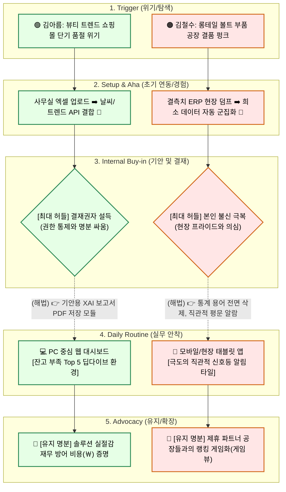

# 08_여정지도_CJM_종합

# 핵심 타겟(Core) 고객 여정 지도: 이커머스 MD 김아름

> **페르소나 요약:** 김아름 (32세) / 코스메틱 쇼핑몰 메인 MD / IT/개발 조직이 없는 중소기업 재직
> **목표:** '안정적인 재고 확보'와 '결재권자(대표님) 설득을 위한 명분(데이터)' 획득

---

### 🗺️ B2B SaaS Customer Journey Map (CJM) - 핵심 타겟(김아름)

| 단계 | 고객 행동 | 고객 생각 | 감정 | Pain Point | 개선 기회 |
| :--- | :--- | :--- | :--- | :--- | :--- |
| **1. Trigger (위기/탐색)** | 어제 터진 뷰티 트렌드를 놓쳐 재고가 동나고 사장에게 깨짐. 구글에 당장 쓸 수 있는 엑셀/툴 검색. | "아 또 터졌네.. 내 통계 엑셀이 미래를 어떻게 맞추냐. 매일 커뮤니티 쫓아다니기도 지치고 두렵다." | 🤬 억울함, 압박감 | 어차피 대기업만 쓰는 수천만 원짜리 구축형 시스템일 거라고 단정하고 도입 문의조차 포기. | **[메인 플라이휠]** 랜딩 페이지 1줄: "구축비 0원, 월 30만 원으로 대표님께 품절을 막았다고 보고하세요." |
| **2. Setup & Aha (초기 연동/경험)** | 데모 가입 후, 평소 쓰던 '과거 3년 치 판매 엑셀' 원본을 그대로 업로드하고 기상 연동 클릭. | "민감한 회사 데이터 올려도 되나? 수식 다 깨진 내 엑셀 양식을 AI가 알아서 인식할 수 있을까?" | 😟 의심 ➡️ 🤩 놀라움 | 엑셀 데이터 양식이 회사마다 제각각이라, 업로드 및 포맷 매핑 과정에서 오류가 나고 빡쳐서 이탈. | **[포맷 프리 자동 설정]** 표 머리글 자동 인식 UI 적용 및 기상청/키워드 로직 원클릭 동기화 (Aha-moment). |
| **3. Internal Buy-in (기안 및 결재)** | "내일 기상 악화로 A크림 발주량 15% 추가 권장" 예측 화면을 캡처하여 결재 기안서에 첨부. | "이 숫자만 덜렁 주면 대표님이 '이 봇을 어떻게 믿냐'고 반려하시겠지.. 설득할 명분 증거가 필요해." | 😰 불안함, 긴장 | 결재권자가 "이 AI가 책임을 질 거냐? 이유가 뭐냐"며 기안을 반려하고 안전한 기존 엑셀로 원상 복구 명령. | **[XAI 보고서 자동화]** 예측치 우상단에 "👉 기안용 AI 분석 근거 보고서 PDF 저장" 버튼 제공. |
| **4. Daily Routine (실무 안착)** | 매일 출근 직후 오전 9시, 엑셀 대신 대시보드 URL에 직행하여 알림(Push)부터 확인. | "아침마다 발주수량 계산하느라 내 황금 시간 2시간씩은 뺏겼을 텐데 확실히 숨통이 트인다 대박이네." | 😌 안도감, 편안함 | 차트가 너무 복잡해서 다변량 통계 툴처럼 보임. 당장 오늘 '몇 개를 사야 하는가' 직관적인 지시 액션이 없음. | **[To-do 기반 알림]** 대시보드 메인에 잔고가 부족한 '발주 시급 품목 Top 5' 타일 보드 형태로 강렬한 넛지. |
| **5. Advocacy (확장/유지)** | 분기 실적 회의에 "솔루션 도입 후 품절 0건, 악성 재고 폐기 20% 감소" 실력을 입증하고 상위 플랜 허가 확보. | "내가 단순 엑셀 노가다꾼이 아니라 진짜 '데이터 통제형 MD'로 인정받는구나. 연봉 협상 때 이 근거 꼭 써야지." | 👑 성취감, 우월감 | B2B 솔루션 가격 불만 심화. "이제 대충 상품 계절 패턴 파악했으니 구독 끊고 다시 우리 엑셀로 가자"는 압박. | **[ROI 지속 증명]** 월간 리포트에 '본 솔루션으로 절감한 방어 재무 실적(￦)'을 찍어주어 계속 결제할 당위성 방어. |

---

# 극단 타겟(Extreme) 고객 여정 지도: 다품종 공장장 김철수

> **페르소나 요약:** 김철수 (48세) / 영세 뿌리산업 제조사 공장장 / IT 및 기술 불신 심함
> **목표:** '1만 개가 넘는 다품종 재고의 수작업 통제 불능 상태'에서 벗어나 현장 노가다 최소화

---

### 🗺️ B2B SaaS Customer Journey Map (CJM) - 극단 타겟(김철수)

| 단계 | 고객 행동 | 고객 생각 | 감정 | Pain Point | 개선 기회 |
| :--- | :--- | :--- | :--- | :--- | :--- |
| **1. Trigger (위기/탐색)** | 반년에 한 번 나갈까 말까 한 '롱테일 C급 볼트' 대량 주문이 터졌는데, 원자재 세팅을 못 해둬서 공장이 마비됨. | "품목이 만 개인데 내가 신도 아니고 우째 다 맞추나... 근데 계속 펑크 나고 납기 늦어지니 미치겠네." | 📉 자포자기, 패배감 | IT 툴 문의나 데모 가입 폼 적는 것 자체가 극딜 장벽. 입력하기 귀찮아서 브로셔 단계에서 이미 이탈. | **[온보딩 장벽 파괴]** 답답한 가입 폼 대신 '기존 더러운 엑셀 던져넣고 무료 진단받기'와 같은 직관적 버튼 1개만 배치. |
| **2. Setup & Aha (초기 연동/경험)** | 판매량 변수가 결측치(0)로 90% 이상 비어있는 엉망진창 공장 ERP 덤프 데이터를 무작정 솔루션에 투척함. | "나 진짜 이런 거 복잡해서 딱 질색인데. 우리 공장 빈칸투성이 쓰레기 엑셀이 들어간다고 뭐 답이나 나올까?" | 😥 회피 ➡️ 🤯 놀라움 | 대기업의 훌륭한 시계열 AI 모델도 현장 롱테일 부품의 0(Zero) 행렬에 막혀 오류나 쓰레기 예측을 내뱉음. | **[초강력 군집화 렌더링]** 비어있는(희소) 부품을 자동차 지수 등 거시 경제 블록에 묶어 '비슷한 C군 부품 5개 덩어리'로 자동 분류 예측. |
| **3. Internal Buy-in (기안/의사결정)** | 본인이 결재권자이므로 사내 기안이 아닌 나 자신과의 싸움 진행. "한 달만 화이트보드랑 AI가 붙어서 테스트해 보자." | "AI가 지가 뭔데 날 가르쳐? 공장 돌아가는 거 일자무식인 깡통이 틀리기만 해봐라 욕하고 바로 버린다." | 🤨 강한 견제, 의심 | 어차피 현장 30년 짬(직관)에 부딪혀 "말도 안 되는 수치"라 무시당하고 AI 데이터에 대한 신뢰 하락. | **[통계 용어 전면 삭제]** 그래프 대신 "공장장님, 다음 주 자동차 수요 터지니 A그룹 나사들 미리 찍어두세요" 평문 텍스트 채택. |
| **4. Daily Routine (실무 안착)** | 먼지가 흩날리는 공장 현장에서 PC 대신 산업용 태블릿/핸드폰 앱만 켜서 전체 가동 신호등만 짧게 3초간 훑어봄. | "어? 안 귀찮네? 그냥 아침에 빨간불 들어온 부품군만 원자재 입고하라고 반장한테 오더 치면 끝나네. 편하다." | 😮 안도감, 만만함 | 사무실 책상에 앉아 모니터 보고 대시보드 클릭할 시간이 현장직 특성상 소화/할당될 수가 없음. | **[초특급 현장 가시성 지원]** 복잡한 차트를 완전히 배제, 멀리서도 보이는 큰 글씨 신호등 타일(🔴부족, 🟢안전, 🟡대기) 직관적 UX. |
| **5. Advocacy (확장/유지)** | 주변 협력업체(도금판/주물 공장 등) 회식 자리에서 자기 스마트폰을 만지작거리며 "알아서 묶어주는 앱"이라고 자랑. | "이 폰 1개 도입하길 잘했다. 머리 아프게 부품 만 개 다 화이트보드에 안 적어 살아도 되구만." | 😎 통제감, 자부심 | "이제 AI가 어떻게 맞추는지 대축 감 잡았으니 당장 구독 취소하고 다시 화이트보드로 땜빵하자"는 매너리즘. | **[Gamification 유지]** 주변 다른 협력 공장들의 평균과 가동 최적화율을 비교해 주는 랭킹 요약표를 카톡으로 전송해 승부욕 자극. |

---

# 핵심(Core) vs 극단(Extreme) 여정의 패턴 차이 시각화 비교

이커머스 MD(김아름)와 다품종 영세 공장장(김철수)은 우리 B2B AI SaaS를 만났을 때 완전히 상반된 장벽과 요구사항을 가집니다. 이를 3가지 시각화 포맷으로 대조 분석했습니다.

---

## 💡 방법 1. 대조형 '미러 테이블'

두 타겟의 환경과 요구 기능이 어떻게 데칼코마니처럼 극명하게 엇갈리는지 보여주는 직관적인 대조표입니다. 

| 🟢 핵심 타겟: 김아름 (이커머스MD) | 🎯 CJM 충돌 지점 | 🟠 극단 타겟: 김철수 (공장장) |
| :---: | :---: | :---: |
| 유튜브/기상 변경에 의한 급격한 단기 품절 위기 | **1. Trigger (도입 계기)** | 롱테일 C급 나사 재고의 만성적 결품 펑크 |
| "회사 기밀, 엑셀 폼 안 깨지고 연동될까?" | **2. 주요 속마음** | "기계 깡통이 내 빈칸투성이 데이터를 알아?" |
| **타인(결재권자/대표)의 인정과 투자 설득** | **3. 최대 이탈 장벽 (Buy-in)** | **본인 스스로의 기계 불신과 진입/학습 한계** |
| 💻 조용한 탕비실/사무실 내 본인 책상 (PC 웹) | **4. 메인 사용 환경 (Routine)** | 🏭 기계가 돌아가는 시끄럽고 바쁜 조업 현장 |
| 방어용 기안 보고서 생성 (PDF 다운로드 모듈) | **5. SaaS 필수 개발 (MVP)** | 극단적 직관성 부여 (모바일 신호등 UX 뷰) |

## 💡 방법 2. 5단계 분기형(Diverging) 여정 구조도 (Mermaid)

동일하게 B2B SaaS 여정을 시작하지만, 5개의 단계(Trigger 👉 Setup 👉 Buy-in 👉 Routine 👉 Advocacy)를 거치면서 두 집단이 **어떻게 완전히 다른 폼팩터와 기능으로 갈라져 정착하는지**를 시각화한 구조도입니다.

 

## 💡 방법 3. 고객 관점 한 줄 요약 훅 (Hook)

원페이지(One-page) 보고서나 피치덱(Pitch Deck)의 헤드라인으로 활용하여 각 사업부 개발 방향성의 핵심 목적을 대변하는 문장입니다.

* 👩‍💼 **김아름(핵심)의 패턴:** "나는 매일 통계를 돌릴 시간은 없고, 당장의 결품을 막음과 동시에 **대표님을 설득할 든든한 증거(명분)**가 절실해!" 
* 👨‍🔧 **김철수(극단)의 패턴:** "나는 공장 쓰레기 엑셀을 무작정 던질 테니 복잡한 그래프일랑 싹 다 치우고, 현장에서 알아 들을 수 있는 **짧은 신호(알람)**만 줘!"
