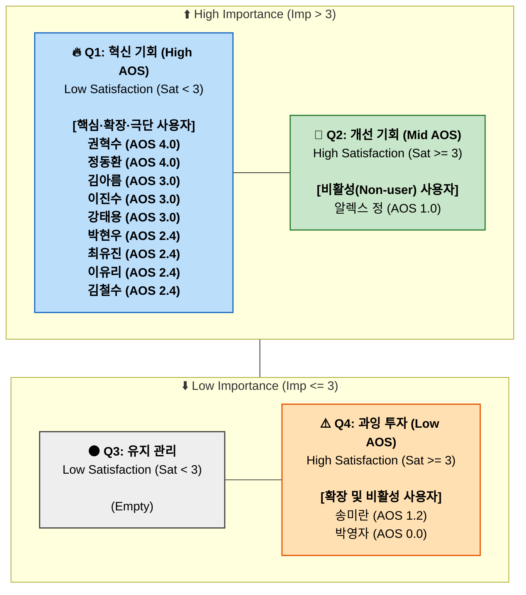
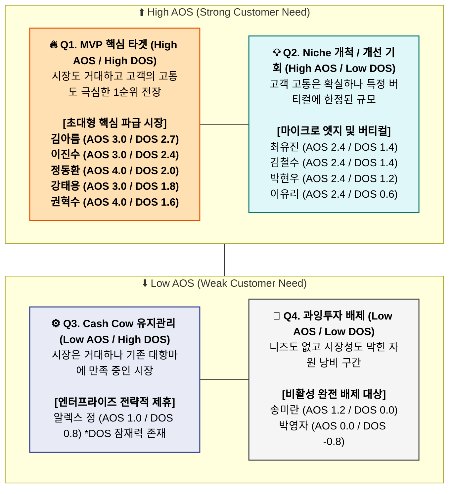

# 09_기회점수_종합

# 1. AOS 기회점수 Matrix 사분면 시각화

12개의 페르소나들을 중요도(Importance) 3점과 만족도(Satisfaction) 3점을 기준으로 상하좌우를 분할하여 **사각형 매트릭스(플로우 차트 형태)**로 맵핑했습니다. 각 사분면 박스 안에 AOS 점수가 높은 타겟부터 내림차순 정렬하여 글자 겹침 없이 모바일에서도 한눈에 읽을 수 있도록 최적화했습니다.

---

### 📊 AOS 매트릭스 다이어그램 (Mermaid)

---

### 💡 매트릭스 기반 프로덕트 Action 전략

리스트업된 다이어그램에 의거해 자원 분배 전략(MVP Scope)을 최종 확립합니다.

1. **[🔥 Q1 구역] 무조건적인 MVP (1차 스프린트 타겟)**
   * 압도적으로 자원이 **좌상단(Q1)**에 쏠려 있습니다. 이는 B2B 수요예측 시장이 엄청난 규모와 임팩트를 지녔음에도 불구하고, 아직 다수의 실무자가 만족할 만한 IT 툴을 찾지 못했다는 완벽한 개발 명분이 됩니다.
   * **행동:** AOS 3.0을 넘기는 5인의 리더(권혁수, 정동환, 김아름, 이진수, 강태용) 그룹을 위해 **날씨/유행/유통기한/프로모션 외부 API**의 통합 파이프라인 개발에 리소스 80%를 집중합니다.

2. **[💎 Q2 구역] 스케일업을 위한 API 전략 유지**
   * 알렉스 정은 사양이 까다로운 대기업군입니다. 자사의 기존 환경을 신뢰(Sat: 4점)하므로 전면전은 불필요합니다. 
   * **행동:** 그들이 요구하는 수준의 화면 인터페이스(UI) 개발 스펙을 배제하고, 핵심 에측 엔진만 꽂아줄 수 있는 'Headless API 데이터 연결' 위주로 영업 타겟 포지셔닝을 바꿉니다.

3. **[⚠️ Q4 구역] 매몰 비용 방지 및 완전 배제**
   * 송미란(단골 전화 영업 만족)과 박영자(아날로그 직관 만족)는 기존 방식에 너무 고착화되어 중요도(High Imp)를 상실한 집단입니다.
   * **행동:** 이들이 "앱이 어렵다, 불편하다"고 피드백을 주더라도 이를 우리 MVP 개선 사항에 절대 반영해선 안 됩니다. (오버 엔지니어링 즉각 중단 판단)

---

# 2. DOS (발견된 기회 점수) 산출 및 AOS-DOS 비교 매트릭스

고객 1명의 체감 강도를 나타내는 **AOS(조정형 기회점수)**에서 한 발 더 나아가, 각 세그먼트의 **시장 규모(TAM%)**라는 리얼 비즈니스 지표를 곱하여 **DOS(시장 파급력을 고려한 진짜 기회 점수)**를 산출했습니다.

이를 통해 "고객의 페인은 크지만 시장이 너무 좁은 타겟"과 "페인도 크고 시장도 엄청나게 거대한 타겟"을 명확히 필터링할 수 있습니다.

---

## 1️⃣ 페르소나 12인 기회점수 통합 산출 테이블 (OS ➡️ AOS ➡️ DOS)

* **OS 수식:** `Importance × 2 - Satisfaction` (전통적 불만족 지표)
* **AOS 수식:** `Importance × (1 - Satisfaction / 5)` (AOS / 고객 체감 강도)
* **DOS 수식:** `(Importance - Satisfaction) × Market Relevance(TAM%)` (DOS / 시장 파급력 가중치)

| 페르소나 (유형) | 핵심 문제 (Pain) 및 해결 목표 (Goal) | Imp | Sat | OS | AOS | TAM(%) 가중치 | **DOS** | 사분면 (AOS-DOS) | 점수 해석 및 제품/시장 전략 (Insight) |
| :--- | :--- | :---: | :---: | :---: | :---: | :---: | :---: | :---: | :--- |
| **김아름** (Core) | **외부 변수(날씨/트렌드) 미반영 극심한 품절 방어** → 기상 지수 연동 일일 발주 권장량 산출 | 5 | 2 | **8.0** | **3.0** | **0.9** | **2.7** | **Q1** (혁신) | **[시장 선점 1순위 타겟]** 미충족 수요와 시장 볼륨(이커머스 SME)이 동시 극대화된 지점. 가장 빠르게 개발해야 할 우리 MVP 코어 기능. |
| **이진수** (Core) | **초국지적 기상 변동에 따른 오프라인 식자재 폐기** → 상권 단위 트래픽/재고 분배량 파악 | 5 | 2 | **8.0** | **3.0** | **0.8** | **2.4** | **Q1** (혁신) | **[핵심 거점 확보]** F&B 프랜차이즈의 수익을 갉아먹는 날씨발 폐기를 방어함. 이커머스 다음으로 시장 볼륨(0.8)이 큼. |
| **정동환** (Core) | **화주 프로모션 누락에 따른 알바 일당 인건비 덤핑** → 내일 단기 출고 물동량 연동 및 인력 최적화 | 5 | 1 | **9.0** | **4.0** | **0.5** | **2.0** | **Q1** (혁신) | **[숨은 블루오션]** B2B 물류(3PL) 파급력은 0.5 수준이나, 현재 대안이 붕괴(Sat 1)되어 AOS가 4.0이므로 선점 시 독점 가능. |
| **강태용** (Ext) | **반나절 기상 오차에 따른 신선 배송 생태계 붕괴** → 극초단기 수요 스파이크 실시간 제어 로직 | 5 | 2 | **8.0** | **3.0** | **0.6** | **1.8** | **Q1** (혁신) | **[트렌드 대응]** 당일/새벽배송 시장 확장에 맞물려 당사 솔루션의 '실시간 방어 기능' 해자를 세일즈하기 가장 좋은 케이스. |
| **권혁수** (Adj) | **온도/유통기한 이탈 시 수억 원 하드코어 전량 폐기** → 보건 API 연동 유통기한 임계점(Constraint) 제로화 | 5 | 1 | **9.0** | **4.0** | **0.4** | **1.6** | **Q1** (프리미엄) | **[고수익 Add-on 기회]** 타겟 생태계 보급률(TAM 0.4)은 작으나 한 번의 실수가 파멸적. 범용 SaaS 런칭 후, 초고가 옵션으로 별도 판매. |
| **최유진** (Core) | **마케팅 집중 시기의 트래픽-재고 소진 시뮬레이션** → 광고 예산 변동에 따른 What-If 예측 도출 | 4 | 2 | **6.0** | **2.4** | **0.7** | **1.4** | **Q2** (개선) | **[부서간 사일로 타파]** 마케터들의 IT 수용도(0.7)가 높음. 코어 런칭 후 업셀링(Upsell) 영업 단계에서 추가할 개선 부가 기능. |
| **김철수** (Ext) | **방치된 희소 결측치(0)와 복잡한 PC 조작법의 장벽** → 희소 데이터 군집화 및 심플 모바일 신호등 UX | 4 | 2 | **6.0** | **2.4** | **0.7** | **1.4** | **Q2** (개선) | **[Niche 대량 장악]** 기술 발전이 더딘 뿌리 산업이 꽤 넓게 분포함(0.7). 현장 특화 UX를 강점으로 아날로그 집단을 쓸어 담음. |
| **박현우** (Core) | **AI 블랙박스 불신 및 임원진/결재권자 설득 난해** → 보고용/기안용 설명 가능한 예측(XAI) 리포트 추출 | 4 | 2 | **6.0** | **2.4** | **0.6** | **1.2** | **Q2** (개선) | **[도입 명분 부여]** 실무자의 사내 정치(기안 통과)를 도울 방어막. B2B 영업 마찰을 줄이기 위해 기획팀이 집중해야 할 무기. |
| **이유리** (Adj) | **오프라인 팝업 무형 공간의 불규칙한 서비스 트래픽** → 실물이 아닌 공간/시간 기반 트래픽 시뮬레이션 | 4 | 2 | **6.0** | **2.4** | **0.3** | **0.6** | **Q2** (엣지) | **[롱테일 유즈케이스]** 시장성(TAM)은 한정적(0.3)이나 프로덕트 적용 범위를 오프라인 임대 서비스업으로 다각화할 때 가치가 큼. |
| **알렉스 정** (Non) | **폐쇄망 생태계를 역행하는 SaaS 완제품의 이질감 방어** → 화면(UI) 없이 메인 DB망에만 이식(수혈)하는 단독 모듈 | 5 | 4 | **6.0** | **1.0** | **0.8** | **0.8** | **Q3** (캐시카우)| **[엔터프라이즈 제휴]** 자체 시스템 만족도가 높아 완제품 판매 불가. 잠재된 거대 자본(0.8)을 노려 모듈 단위를 납품하는 B2B SI 공략. |
| **송미란** (Adj) | **기존 영업망 땜빵을 넘는 B2B 거시 변수 동향 파악** → 재택/근로 지수를 반영시킨 B2B 특화 융합 예측 | 3 | 3 | **3.0** | **1.2** | **0.5** | **0.0** | **Q4** (과잉투자)| **[후순위 방치]** 현재 인맥 관행 영업으로 버티는 구간이라 SaaS 필수 결제 전환 니즈가 약함. 무리한 유료 개발 자원 투입 제외. |
| **박영자** (Non) | **디지털/전산화 거부감으로 인한 아날로그 체계 고착** → 앱 가입 보상이나 사용 동기 부여 (불가능한 목표) | 1 | 5 | **-3.0**| **0.0** | **0.2** | **-0.8** | **Q4** (배제)| **[완벽한 데스밸리]** 고객 니즈(AOS)와 제품 파급력(DOS) 전부 마이너스. 좋은 화면을 만든다고 시간 쓰지 말고 영업 풀에서 영구 배제. |

---

## 2️⃣ AOS vs DOS 기반 4사분면 (전략 매트릭스)

> **분류 기준:** High AOS (≥ 2.4), High DOS (≥ 1.5)

---

## 🧠 기획 인사이트 요약

1. **초대형 핵심 파급 시장 (AOS 3.0 / DOS 2.7)**
   * **김아름(이커머스 MD)**는 고객 개인의 고통(AOS 3.0)도 매우 높지만, 이커머스라는 거대한 덩어리(TAM 90% 비중)를 들고 있어 시장 체급 곱셈인 DOS가 2.7로 압도적 1위를 기록했습니다. 
   * **PM 전략:** 무조건 우리 회사는 이 이커머스 버티컬부터 뚫어야 초기 J커브와 런웨이 돌파가 가능합니다. 가장 1순위로 '날씨 연동 동적 권장량 기능'을 릴리즈해야 합니다.

2. **작지만 고통 제로의 틈새 고수익망 (AOS 4.0 / DOS 1.6)**
   * **권혁수(바이오 콜드체인)**는 고객의 절박함(AOS 4.0)은 이커머스 그룹을 이길 만큼 전 페르소나 중 가장 극악입니다. 하지만 바이오 틈새시장(TAM 40% 비중)이기에 DOS는 1.6으로 강태용/김아름 등에 밀려 Q1의 꼬리 부근에 위치합니다.
   * **PM 전략:** 특수 목적형 **초고가 '프리미엄 Add-on (B2B 하드코어 요금제)'** 형태로 객단가를 미친 듯이 올려서 어필해야 합니다.
