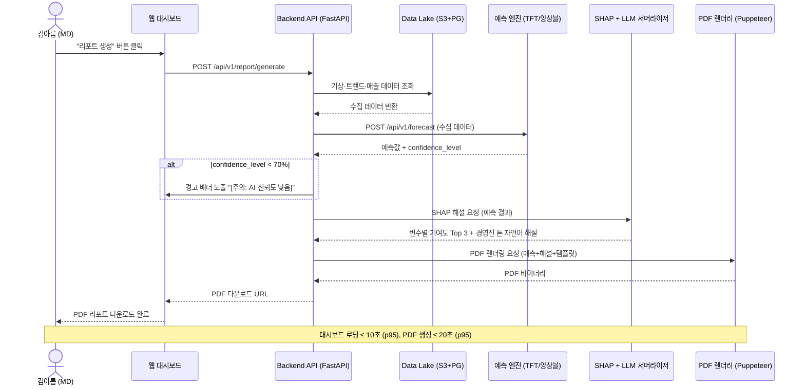
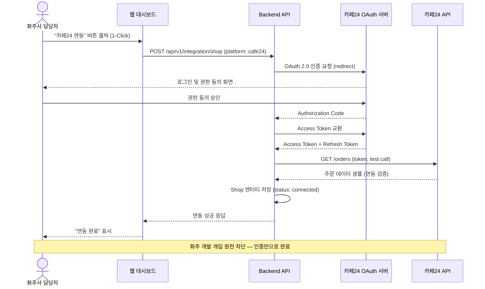
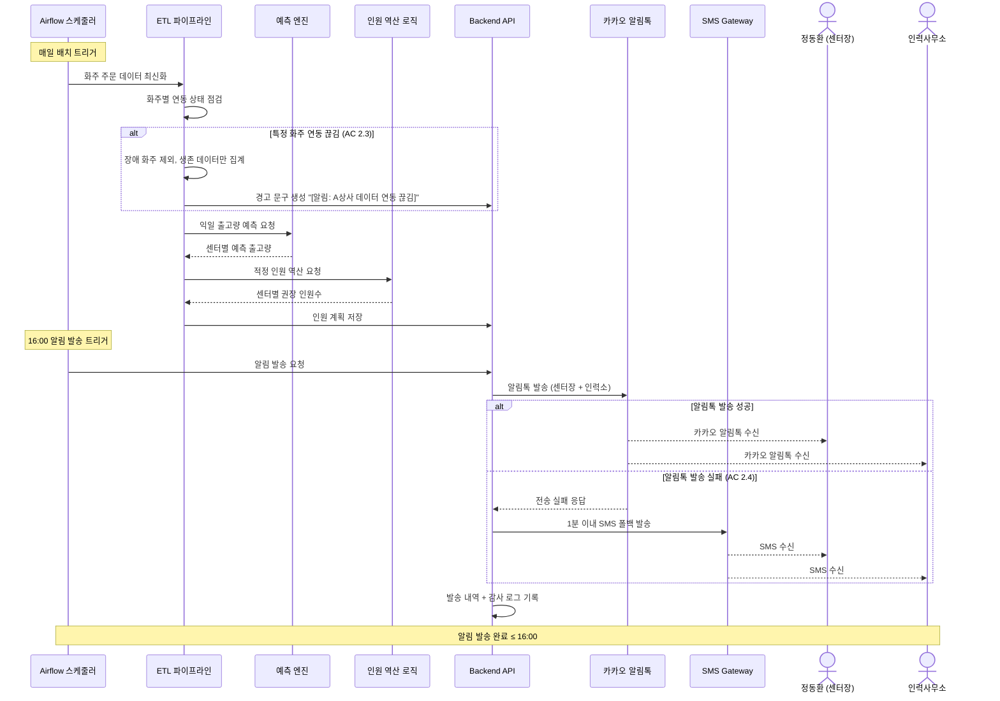
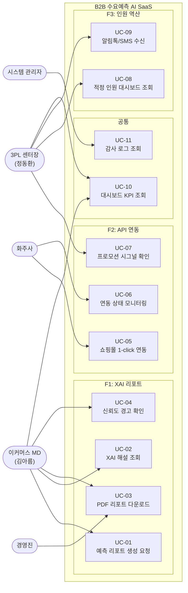
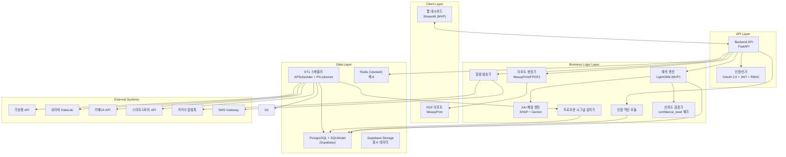
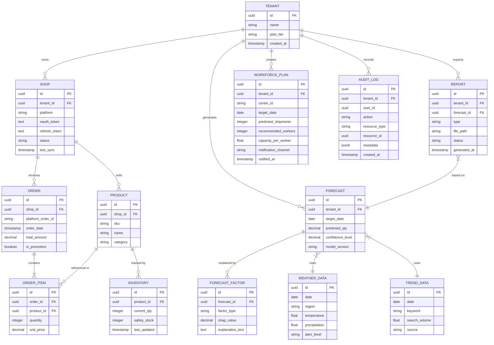
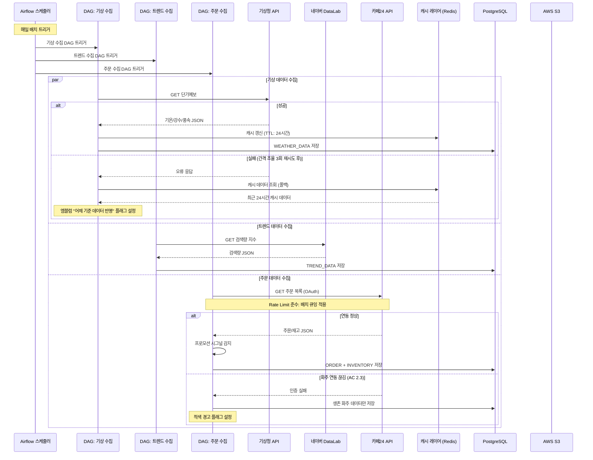
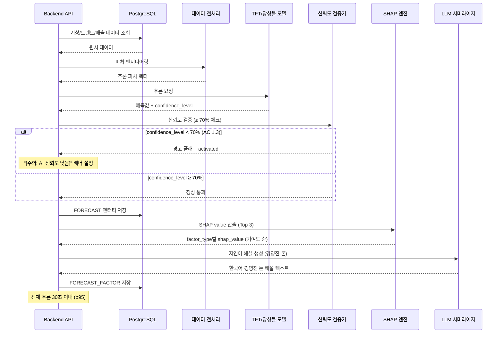
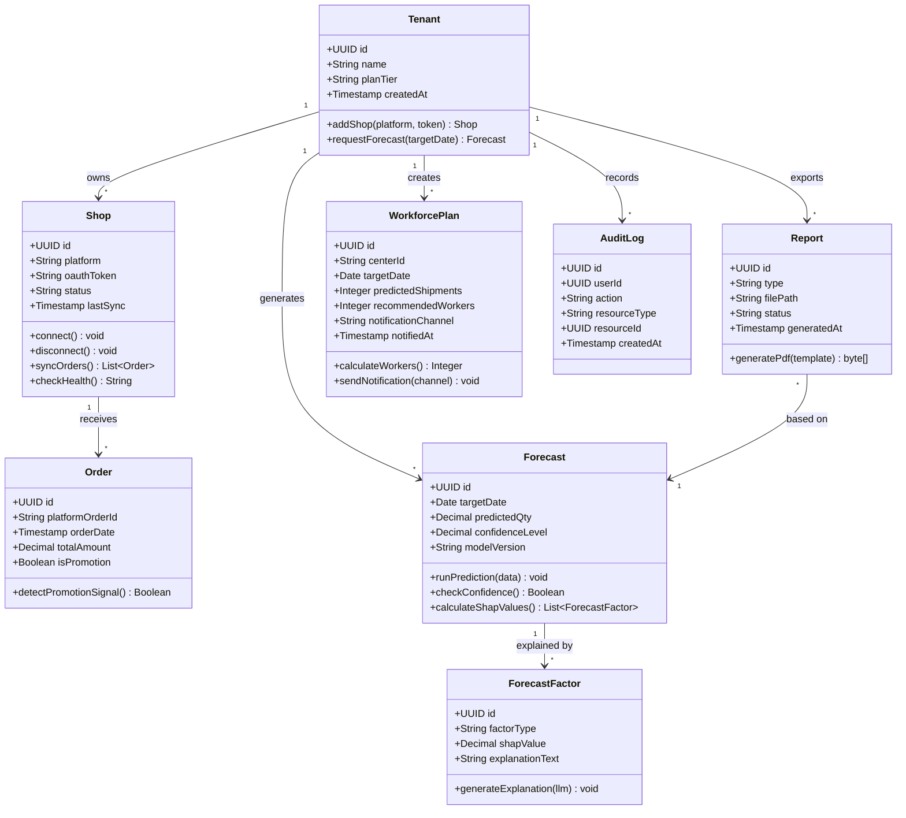

# Software Requirements Specification (SRS)

**Document ID:** SRS-V1.0  
**Revision:** 1.0  
**Date:** 2026-04-20  
**Standard:** ISO/IEC/IEEE 29148:2018  

---

| 항목 | 내용 |
|---|---|
| **프로젝트명** | B2B 수요예측 AI SaaS |
| **작성자** | Senior Requirements Engineer |
| **승인 상태** | ✅ **V1.0 확정** — ADJ-01~08 반영 완료. TASK 추출 가능 |
| **PRD 원본** | PRD v1.1 (2026-04-18) |
| **선행 SRS** | SRS-002 Rev 1.0 (PRD v1.0 기반) |

---

## 1. Introduction

### 1.1 Purpose

본 SRS는 **B2B 수요예측 AI SaaS** 시스템의 소프트웨어 요구사항을 정의한다.

본 시스템은 다음 문제를 해결한다:

> 자체 IT 인프라나 고급 데이터 분석 조직이 없어 수요 관리에 취약한 이커머스 SME 실무자(MD)와 3PL 물류센터장이, 날씨·트렌드·돌발 프로모션 등 예측 불가한 외부 변수를 즉각 반영하여 당일 발주량 및 창고 인력 스케줄을 결정해야 하는 상황에서, 수기 엑셀과 직감에 의존하여 경영진 결재 반려·대규모 결품·오버스케줄링 인건비 낭비가 반복되는 문제를 해결한다.

본 시스템은 단순 수치 계산기를 넘어, 투명한 데이터 근거(XAI)를 제공해 경영진 결재를 한 번에 관통시켜 주는 **"의사결정 안전망"**으로 작동한다.

> **PRD v1.1 핵심 전환:** 바이오 콜드체인(IoT 관제) 시나리오는 극단적 프리미엄 니치로 판명되어 제품 집중도를 위해 **전면 배제(Out of Scope)**되었다.

본 문서의 대상 독자는 개발 팀, QA 팀, 프로젝트 관리자, 사업 이해관계자이다.

### 1.2 Scope

#### 1.2.1 In-Scope (MVP)

| ID | 항목 | 설명 | PRD 참조 |
|---|---|---|---|
| SCOPE-IN-01 | F1. XAI 원클릭 리포트 추출 | 딥러닝 예측 + 원인 해설 자연어 엔진(XAI) + 임원용 PDF 출력 모듈. SHAP 기반 외부 변수 Top 3 자연어 해설 포함 | PRD §4-1 F1, §3 Story 1 |
| SCOPE-IN-02 | F2. 쇼핑몰 API 원클릭 연동 모듈 | 물류 센터-화주 간 마찰 없는 마켓 API 1-Click OAuth 연동. **Phase 1: 카페24 단독**, 스마트스토어는 Phase 1.5에서 추가 (ADJ-01). 화주사 개발 개입 원천 차단 | PRD §4-1 F2, §3 Story 2 |
| SCOPE-IN-03 | F3. 적정 인원 역산 대시보드 | 출하 용량(Capacity) 역산식 기반 적정 인원 도출 및 카카오 알림톡 자동 발송 (매일 16:00) | PRD §4-1 F3, §3 Story 2 |

#### 1.2.2 Out-of-Scope

| ID | 항목 | 배제 사유 | 재진입 조건 | PRD 참조 |
|---|---|---|---|---|
| SCOPE-OUT-01 | F4. 콜드체인 차량 배차 및 온도 이탈 노선 재설정기 | GPS/IoT 하드웨어 연계 난이도로 Add-on SaaS 정체성과 이질적 — **Won't** | MVP (F1~F3) 궤도 안착 후 프리미엄 티어 확장 시 재검토 | PRD §4-1 Won't |
| SCOPE-OUT-02 | F5. 예산 지출 연동 What-IF 시뮬레이터 | MVP 이후 Fast Follower 배포 대상 — **Should** | F1~F3 안정화 후 | PRD §4-1 Should |
| SCOPE-OUT-03 | F6. 모바일 신호등(적/녹/황) 초간단 방식 UX | 노안 현장 작업자 접근성 대시보드 — **Could** | 사용자 피드백 수집 후 | PRD §4-1 Could |

#### 1.2.3 제품 원칙 및 의사결정 게이트 (Decision Gate)

> PRD v1.1에서 신규 도입된 기준. 이 원칙에 2가지 이상 위배되는 기능 요구는 기각(Reject)된다.

| # | 원칙 | 설명 | PRD 참조 |
|---|---|---|---|
| P-01 | 기술보다 '보고/실무' 우선 | "AI의 예측 정확도"보다 "대표님이 결재해주기 편한 문서(PDF) 형태의 설득력"이 더 중요하다 | PRD §1-2 |
| P-02 | 복잡도 제로 (Add-on 기생 전략) | 커다란 새로운 대시보드를 학습시키지 않는다. 쇼핑몰 플랫폼 통합(1-Click) 기반의 백그라운드 구동을 지향한다 | PRD §1-2 |
| P-03 | 가시적인 비용 방어 원칙 | 도입 ROI를 즉시 증명할 수 없는 모호한 통합 기능은 만들지 않는다 | PRD §1-2 |

### 1.3 Definitions, Acronyms, Abbreviations

| 용어 | 정의 | PRD 참조 |
|---|---|---|
| **JTBD (Jobs to be Done)** | 사용자가 특정 상황에서 달성하고자 하는 핵심 과업 | PRD §2, §9 |
| **XAI (Explainable AI)** | 예측 결과에 대해 변수별 기여도를 인간이 이해 가능한 형태로 제시하는 AI 기술 | PRD §3, §4 |
| **SHAP (SHapley Additive exPlanations)** | 개별 예측에 대한 변수별 기여도를 산출하는 XAI 기법 | PRD §3 Story 1 AC 1.1 |
| **TFT (Temporal Fusion Transformer)** | 다변량 시계열 예측 딥러닝 모델. 앙상블 구성 시 사용 | PRD §4-3 |
| **N-BEATS** | Neural Basis Expansion Analysis for Time Series. 시계열 예측 딥러닝 모델 | PRD §6-2 |
| **Leading Metrics (선행 지표)** | 최종 재무 결과 이전에 시스템 성공 여부를 예측할 수 있는 사용자 행동 지표 | PRD §1-4 |
| **1-Pass 통과** | 실무자의 기안이 수정 없이 경영진에게 즉시 승인되는 상태 | PRD §1-4 |
| **MoSCoW** | Must / Should / Could / Won't 우선순위 분류 체계 | PRD §4-1 |
| **ETL (Extract, Transform, Load)** | 데이터 추출·변환·적재 파이프라인 | PRD §6-2 |
| **멀티테넌트** | 단일 인프라에서 복수 고객의 데이터를 논리적으로 격리하여 운영하는 구조 | PRD §5-2 |
| **Anxiety** | 사용자가 시스템 도입 시 느끼는 심리적 불안감 (예: "AI가 틀리면 내 독박") | PRD §1-1, §3 |
| **RPO (Recovery Point Objective)** | 장애 발생 시 허용 가능한 최대 데이터 손실 시점 | SRS 자체 보완 |
| **RTO (Recovery Time Objective)** | 장애 발생 후 서비스 복구 목표 시간 | SRS 자체 보완 |

### 1.4 References

| ID | 문서 / 출처 | 설명 |
|---|---|---|
| **REF-01** | PRD v1.1 (2026-04-18) | 본 SRS의 원천 문서 (Product Requirements Document) |
| **REF-02** | ISO/IEC/IEEE 29148:2018 | Systems and software engineering — Requirements engineering |
| **REF-03** | ADR-01: 모델 자체 내재화 결정 | SHAP 커스텀 변수 추출을 위해 AWS Forecast 대신 자체 시계열 모델 채택 (코어 IP화 필수). MVP: Prophet/LightGBM → Phase 2: TFT/앙상블 |
| **REF-04** | ADR-02: WeasyPrint 기반 PDF 출력 (MVP) | HTML/CSS 템플릿 → PDF 변환. 엑셀 세대 체감 만족도 보장. Phase 2에서 Puppeteer 전환 가능 |
| **REF-05** | 기상청 단기예보 API 공식 문서 | API 스펙, Rate Limit, 응답 포맷 |
| **REF-06** | 카페24 Open API 공식 문서 | 주문/재고 API 스펙, OAuth 2.0, Rate Limit |
| **REF-07** | 네이버 스마트스토어 커머스 API 공식 문서 | 주문/상품 API 스펙, 인증 |
| **REF-08** | 네이버 DataLab 검색어 트렌드 API 공식 문서 | 검색량 지수 API 스펙 |
| **REF-09** | 카카오 알림톡 API 공식 문서 | 발송 API, 템플릿 관리, 과금 체계 |

### 1.5 Assumptions & Constraints

#### 1.5.1 가정 (Assumptions)

| ID | 가정 | PRD 참조 |
|---|---|---|
| ASM-01 | 카페24·스마트스토어 API가 현재 스펙대로 최소 12개월 유지된다 | PRD §7-3 |
| ASM-02 | 기상청 단기예보 API 무료 이용(일 1,000회)이 MVP 기간 동안 지속되며, 배치 큐잉으로 Rate Limit을 초과하지 않게 제어 가능하다 | PRD §7-3 |
| ASM-03 | 파일럿 고객 **2사**가 Sprint 3(Phase 3) 시작 전까지 확보 가능하다 | PRD §7-3 |
| ASM-04 | 클라우드 크레딧(Railway/Render 무료 티어 또는 AWS 스타트업 크레딧) 활용으로 MVP 기간 중 인프라 비용을 최소화할 수 있다. **단, 추가 검증이 필요하며 정책 변동 시 대안 확보 필수 (ASM-05 참조)** | PRD §7-3, SRS 자체 보완 |
| ASM-05 | 클라우드 크레딧 정책 변동 시 대안 전환 가능하다. 대안: ① 타 PaaS 무료 티어 전환 ② Serverless 전환 ③ 경량 모델(Prophet/LightGBM) 유지 | SRS 자체 보완 |

#### 1.5.2 제약사항 (Constraints)

| ID | 제약사항 | PRD 참조 |
|---|---|---|
| CON-01 | 기상청 단기예보 API Rate Limit (일 1,000회) — 배치 큐잉 필수 | PRD §5-1 |
| CON-02 | 카페24 API Rate Limit: 분당 제한 — 캐시 레이어 필수 | PRD §5-1 |
| CON-03 | MVP 기간 인프라 비용 — **임의 책정 수치이므로 실제 인프라 구축 비용에 대한 추가 검증 필요**. 무료/저가 PaaS 우선 활용 전략 병행 | PRD §7-3, SRS 자체 보완 |
| CON-04 | F3(인원 역산)은 F2(API 연동 모듈) 선행 완료 필수 | PRD §7-4 |
| CON-05 | PDF 리포트 양식은 파일럿 고객의 기존 결재 양식 수집 후 확정 | PRD §7-4 |
| CON-06 | 코어 예측 알고리즘은 SaaS API 과금 모델로 IP 보호 — 소스코드 외부 노출 금지 | PRD §4-3 |
| CON-07 | 멀티테넌트 격리는 MVP 기간 **tenant_id 컬럼 기반 Row-Level Isolation** 적용 (ADJ-02). Phase 2에서 스키마 격리 업그레이드 가능. 교차 노출 방지는 API 미들웨어로 강제 | PRD §5-2 |
| CON-08 | 인과성 해설(XAI)의 한국어 렌더링 결과물 품질은 LLM 서머라이저의 한국어 경영진 톤 조정 성능에 의존 | PRD §7-4 |

#### 1.5.3 기술 스택 (C-TEC)

> MVP는 **Python 단일 스택**으로 구현한다. 모든 모듈은 어댑터 패턴(REQ-NF-027)을 적용하여, Phase 2 이후 개별 컴포넌트 교체가 가능하도록 설계한다.

**(시스템 내부 — Python 통합 프레임워크)**

| ID | 제약사항 | Phase 1 (MVP) | Phase 2+ (업그레이드 경로) |
|---|---|---|---|
| C-TEC-001 | 프론트엔드 (대시보드) | **Streamlit** — Python만으로 대시보드 구현. JavaScript 학습 불필요 | React + Recharts 전환 (API 계약 동일) |
| C-TEC-002 | Backend API | **FastAPI** — 비동기 고성능 REST API. 자동 OpenAPI 문서 생성 | 유지 (변경 없음) |
| C-TEC-003 | 데이터베이스 | **PostgreSQL + SQLModel** — 로컬 개발은 Docker PG. 배포 시 Supabase(PostgreSQL) | AWS RDS PostgreSQL 전환 가능 |
| C-TEC-004 | 캐시 | **Redis (Upstash 무료 티어)** — 폴백 캐시 + 알림 큐 | ElastiCache 전환 가능 |
| C-TEC-005 | 예측 엔진 | **LightGBM 우선** (Docker 이미지 경량, 빌드 <10초) + SHAP 완전 호환. Prophet은 선택적 추가 (ADJ-04) | TFT/N-BEATS 앙상블 전환 (어댑터 교체) |
| C-TEC-006 | XAI 해설 | **SHAP** — LightGBM/Prophet/TFT 전 모델 호환 | 유지 (변경 없음) |
| C-TEC-007 | PDF 생성 | **WeasyPrint** (1차) + **FPDF2** (백업, 순수 Python 의존성 제로) — HTML/CSS 템플릿 → PDF (ADJ-06) | Puppeteer 전환 가능 (동일 HTML 템플릿) |
| C-TEC-008 | ETL 스케줄링 | **APScheduler (FastAPI 내장)** + **PostgreSQL jobstore 영속화 필수** (ADJ-05). 서비스 재시작 시 스케줄 유실 방지 | Airflow 전환 가능 (동일 Python 함수) |

**(시스템 외부 — 연결 및 AI 통합)**

| ID | 제약사항 | 상세 | 비고 |
|---|---|---|---|
| C-TEC-009 | LLM 오케스트레이션 | **Google Gemini API** — 환경 변수 설정만으로 모델 교체 가능 | 어댑터 패턴 적용 |
| C-TEC-010 | 배포 및 인프라 | **Railway 또는 Render** — Git Push 자동 배포. 단일 서버에 프론트+백엔드+스케줄러 통합 | Phase 2: AWS ECS 전환 가능 (Docker 동일) |
| C-TEC-011 | 스토리지 | **Supabase Storage 또는 S3 호환** — 원시 데이터 저장 | AWS S3 전환 가능 |
| C-TEC-012 | 알림 | **카카오 알림톡 API + SMS Gateway** — PRD 명시 채널 | 유지 (변경 없음) |

**(개발 환경 및 방법론)**

| ID | 제약사항 | 상세 | 비고 |
|---|---|---|---|
| C-TEC-013 | 개발 환경 표준 | **Docker + docker-compose** — Sprint 0에서 확립. 모든 개발은 컨테이너 내에서 진행하여 OS 차이 원천 차단 (ADJ-07) | 로컬 ≈ 배포 환경 일치 보장 |
| C-TEC-014 | 한국 API 연동 방법론 | 카페24·카카오·기상청 API 연동 시 **공식 문서 전문을 AI context에 직접 주입**(context injection)하며 개발 진행 (ADJ-08) | AI 학습 데이터 부족 보완 |

> **교체 원칙:** 각 C-TEC 항목은 어댑터 인터페이스를 통해 격리되며, Phase 1→2 전환 시 **해당 모듈만 교체**하고 나머지 시스템은 무변경을 보장한다. 상세 교체 경로는 `SRS-V1.0_tech-review.md`를 참조한다.

---

## 2. Stakeholders

| ID | 역할 (Role) | 대표 페르소나 | 책임 (Responsibility) | 관심사 (Interest) | PRD 참조 |
|---|---|---|---|---|---|
| STK-01 | 이커머스 MD | 김아름 (36세, 코스메틱 MD) | 외부 변수 반영 발주량 결정, 경영진 결재 품의서 작성 | 결품/과발주 방어, 엑셀 야근 탈출, 결재 1-pass 달성, 독박 책임 면책 | PRD §2-1 Core 1 |
| STK-02 | 3PL 물류센터장 | 정동환 (45세, 3PL 센터장) | 화주사 출고량 기반 일용직 인원 확정, 출고 관리 | 오버 스케줄링 인건비 절감, 출고 지연 방지, 화주 기습 프로모션 대응 | PRD §2-1 Core 2 |
| STK-03 | 경영진 | — | 발주 품의서 최종 승인 | XAI 해설 기반 의사결정 근거의 투명성, ROI 극대화 | PRD §3 Story 1 |
| STK-04 | 화주사 | — | 판매/프로모션 데이터 API 연동 제공 | 배송 지연 감소, 연동 편의성 | PRD §3 Story 2 AC 2.1 |
| STK-05 | 인력사무소 소장 | — | 일용직 인력 공급 | 정확한 인원 수요 예측에 기반한 적시 인력 배치 | PRD §3 Story 2 AC 2.2 |
| STK-06 | 시스템 관리자 | — | 플랫폼 운영, 모니터링, 장애 대응 | 시스템 가용성 ≥ 99.5%, 모니터링 알림 | SRS 자체 보완 |

---

## 3. System Context and Interfaces

### 3.1 External Systems

| ID | 시스템 | 유형 | 프로토콜 | 설명 | PRD 참조 |
|---|---|---|---|---|---|
| EXT-01 | 기상청 단기예보 API | Inbound | REST/HTTPS | 지역별 기온·강수·풍속 데이터 수집. 일 1회 메인 배치 덤프 | PRD §6, REF-05 |
| EXT-02 | 기상청 중기예보 API | Inbound | REST/HTTPS | 3~10일 예보 데이터 수집. **Phase 2에서 추가** (ADJ-03). MVP에서는 단기예보만 사용 | PRD §6 |
| EXT-03 | 카페24 주문/재고 API | Inbound | REST/HTTPS (OAuth 2.0) | 쇼핑몰 주문·재고 데이터 수집. Rate Limit 분당 제한 | PRD §6, REF-06 |
| EXT-04 | 스마트스토어 API | Inbound | REST/HTTPS (OAuth 2.0) | 쇼핑몰 주문·상품 데이터 수집. **Phase 1.5에서 추가** (ADJ-01) | PRD §6, REF-07 |
| EXT-05 | 네이버 DataLab 트렌드 API | Inbound | REST/HTTPS | 키워드 검색량 지수 수집 | PRD §6, REF-08 |
| EXT-06 | 카카오 알림톡 API | Outbound | REST/HTTPS | 센터장·인력소 자동 알림 발송. 건당 과금, 템플릿 사전 승인 | PRD §6, REF-09 |
| EXT-07 | 클라우드 인프라 (Railway/Render) | Infrastructure | — | 무료/저가 PaaS 우선 활용 (비용 추가 검증 필요 — CON-03). Phase 2: AWS 전환 가능 | PRD §6 |

#### 3.1.1 외부 시스템 장애 시 임시 우회 전략 (Fallback Strategy)

외부 서비스가 가용하지 않은 경우, 아래 우회 전략을 통해 시스템의 핵심 기능을 유지한다.

| 외부 시스템 | 장애 유형 | 우회 전략 | 데이터 소스 | 최대 허용 시간 |
|---|---|---|---|---|
| **기상청 API** (EXT-01, 02) | API 응답 실패 / Rate Limit 초과 | ① Redis 캐시 최근 24시간 기상 데이터로 폴백 ② 과거 이력 DB 유사 패턴 조회 ③ 7일 평균 더미 데이터 주입 + 리포트에 **"금일 실시간 데이터 지연. 어제 기준 데이터 반영"** 엠블럼 표기 (AC 1.4) | `WEATHER_DATA` + Redis 캐시 | 24시간 |
| **카페24 API** (EXT-03) | OAuth 토큰 만료 / API 장애 | ① 최근 동기화 DB 데이터 사용 ② Refresh Token 3회 재시도 후 재연동 안내 ③ **생존 화주 데이터만으로 인원 산출 + 적색 경고** (AC 2.3) | `ORDER`, `INVENTORY` 테이블 | 6시간 |
| **스마트스토어 API** (EXT-04) | OAuth 토큰 만료 / API 장애 | 카페24와 동일 전략 적용 | `ORDER`, `INVENTORY` 테이블 | 6시간 |
| **네이버 DataLab API** (EXT-05) | API 응답 실패 | ① `TREND_DATA` 최근 30일 이력 대체 ② 계절성 지수 기본값 적용 ③ 리포트에 "트렌드 데이터 추정치" 경고 표시 | `TREND_DATA` 테이블 | 48시간 |
| **카카오 알림톡 API** (EXT-06) | API 장애 / 전송 실패 | ① **1분 이내 SMS 단문 자동 폴백 발송** (AC 2.4) ② SMS도 실패 시 대시보드 팝업 + 이메일 대체 ③ 실패 건 큐 보관 후 복구 시 자동 재발송 | 내부 알림 큐 (Redis Queue) | 즉시 대체 |
| **클라우드 인프라** (EXT-07) | 리전/서비스 장애 | ① 크로스 리전 스토리지 백업 ② 읽기 전용 레플리카 자동 장애 조치 ③ 전체 리전 장애 시 수동 DR (RTO ≤ 4시간) | 크로스 리전/AZ 백업 | RTO 4시간 |

> **운영 원칙:** 모든 폴백 전환은 자동으로 수행되며, 전환 시점과 사유가 `AUDIT_LOG`에 기록된다. 폴백 데이터가 사용된 예측 결과 및 리포트에는 해당 엠블럼/경고가 자동 삽입된다.

### 3.2 Client Applications

| ID | 클라이언트 | 기술 | 설명 |
|---|---|---|---|
| CLI-01 | 웹 대시보드 | React + Recharts | 예측 결과 시각화, 인원 역산 대시보드, KPI 모니터링 |
| CLI-02 | PDF 리포트 뷰어 | Puppeteer 생성 PDF | 경영진 결재용 XAI 발주 권장 리포트 (ADR-02) |

### 3.3 API Overview

| ID | API 명 | 방향 | 메서드 | 엔드포인트 (개요) | 입력 | 출력 | PRD 참조 |
|---|---|---|---|---|---|---|---|
| API-INT-01 | 예측 엔진 API | Internal | POST | `/api/v1/forecast` | 수집 데이터 + 파라미터 | 예측값 + SHAP 해설 + confidence_level | PRD §6 |
| API-INT-02 | PDF 리포트 생성 API | Internal | POST | `/api/v1/report/generate` | 예측 결과 + 템플릿 ID | PDF 바이너리 | PRD §6 |
| API-INT-03 | PDF 리포트 상태 조회 API | Internal | GET | `/api/v1/report/{report_id}` | report_id | 리포트 상태 JSON | SRS 자체 보완 |
| API-INT-04 | 쇼핑몰 연동 시작 API | Internal | POST | `/api/v1/integration/shop` | OAuth 토큰, 플랫폼 유형 | 인증 URL | PRD §6 |
| API-INT-05 | 쇼핑몰 OAuth 콜백 API | Internal | POST | `/api/v1/integration/shop/callback` | authorization code, state | 연동 결과 JSON | PRD §6 |
| API-INT-06 | 연동 상태 조회 API | Internal | GET | `/api/v1/integration/shop/{shop_id}/status` | shop_id | 연동 상태 JSON | PRD §6 |
| API-INT-07 | 인원 역산 API | Internal | POST | `/api/v1/workforce/calculate` | 예측 출고량, 센터 정보 | 적정 인원수 + 근거 JSON | PRD §6 |
| API-INT-08 | 알림 발송 API | Internal | POST | `/api/v1/notification/send` | 수신자, 메시지 | 발송 결과 JSON | PRD §6 |
| API-INT-09 | 대시보드 예측 데이터 API | Internal | GET | `/api/v1/dashboard/forecast` | tenant_id, date_range | 예측 + 기여도 JSON | SRS 자체 보완 |
| API-INT-10 | XAI 해설 생성 API | Internal | POST | `/api/v1/xai/explain` | forecast_id | 변수별 해설 JSON | PRD §6 |
| API-EXT-01 | 기상청 단기예보 | Inbound | GET | 기상청 엔드포인트 | 지역 코드, 날짜 | 기온/강수/풍속 JSON | PRD §6 |
| API-EXT-02 | 카페24 주문 API | Inbound | GET | 카페24 엔드포인트 | OAuth 토큰, 기간 | 주문/재고 JSON | PRD §6 |
| API-EXT-03 | 네이버 DataLab | Inbound | GET | 네이버 엔드포인트 | 키워드, 기간 | 검색량 지수 JSON | PRD §6 |
| API-EXT-04 | 카카오 알림톡 | Outbound | POST | 카카오 엔드포인트 | 수신자, 템플릿, 변수 | 발송 결과 JSON | PRD §6 |

### 3.4 Interaction Sequences (핵심 시퀀스 다이어그램)

#### 3.4.1 XAI 발주 리포트 생성 흐름

#### 3.4.2 쇼핑몰 API 1-Click 연동 흐름

#### 3.4.3 적정 인원 역산 및 알림 흐름 (Exception 포함)

### 3.5 Use Case Overview

#### Use Case — Requirement 매핑

| UC ID | 유스케이스 명 | 관련 액터 | 관련 REQ |
|---|---|---|---|
| UC-01 | 예측 리포트 생성 요청 | 이커머스 MD | REQ-FUNC-004, 005, 006, 007 |
| UC-02 | XAI 해설 조회 | 이커머스 MD | REQ-FUNC-005, 006, 010 |
| UC-03 | PDF 리포트 다운로드 | 이커머스 MD, 경영진 | REQ-FUNC-007, 008 |
| UC-04 | 신뢰도 경고 확인 | 이커머스 MD | REQ-FUNC-009 |
| UC-05 | 쇼핑몰 1-click 연동 | 화주사 | REQ-FUNC-011, 012 |
| UC-06 | 연동 상태 모니터링 | 화주사 | REQ-FUNC-016 |
| UC-07 | 프로모션 시그널 확인 | 3PL 센터장 | REQ-FUNC-017 |
| UC-08 | 적정 인원 대시보드 조회 | 3PL 센터장 | REQ-FUNC-019, 021 |
| UC-09 | 알림톡/SMS 수신 | 3PL 센터장 | REQ-FUNC-022, 023 |
| UC-10 | 대시보드 KPI 조회 | 이커머스 MD, 3PL 센터장 | REQ-FUNC-010, 021 |
| UC-11 | 감사 로그 조회 | 시스템 관리자 | REQ-FUNC-028 |

### 3.6 Component Architecture

---

## 4. Specific Requirements

### 4.1 Functional Requirements

#### 4.1.1 F1 — XAI 원클릭 리포트 추출 (Must)

| ID | 요구사항 | Source | Priority | Acceptance Criteria |
|---|---|---|---|---|
| **REQ-FUNC-001** | 시스템은 기상청 단기예보 API로부터 지역별 기온·강수·풍속 데이터를 일 1회 이상 자동 수집하여 Data Lake에 저장해야 한다. | Story 1, F1 | Must | **Given** 기상청 API 연결이 정상 상태일 때 **When** Airflow DAG이 실행되면 **Then** WEATHER_DATA 엔터티에 저장된다. 실패 시 자동 재시도 3회(간격 조율형) 후 Slack 알림. |
| **REQ-FUNC-002** | 시스템은 네이버 DataLab API로부터 키워드 검색량 지수를 일 1회 이상 자동 수집해야 한다. | Story 1, F1 | Must | **Given** 네이버 DataLab API 정상 상태일 때 **When** ETL 스케줄이 실행되면 **Then** TREND_DATA 엔터티에 저장된다. |
| **REQ-FUNC-003** | [Exception] 기상청 API 수집 실패 시, 최근 24시간 캐시 데이터로 자동 폴백하고 **"금일 실시간 데이터 지연. 어제(날짜) 기준 데이터 반영"** 엠블럼을 리포트에 표기해야 한다. | Story 1 AC 1.4 | Must | **Given** 기상청 API 3회 연속 실패일 때 **When** 예측 엔진이 기상 데이터 요청하면 **Then** 캐시 데이터 반환 + 엠블럼 자동 삽입. |
| **REQ-FUNC-004** | 시스템은 예측 모델(MVP: LightGBM, Phase 2: TFT/앙상블) 기반으로 SKU별 수요 예측값과 **신뢰도(confidence_level)**를 산출해야 한다. | Story 1, F1 | Must | **Given** 기상·트렌드·매출 데이터 수집 완료일 때 **When** 예측 엔진 API 호출되면 **Then** predicted_qty + confidence_level이 FORECAST 엔터티에 저장된다. |
| **REQ-FUNC-005** | 시스템은 예측 결과에 대해 SHAP 기반 **변수별 기여도 Top 3**를 산출하고 FORECAST_FACTOR에 저장해야 한다. | Story 1 AC 1.1 | Must | **Given** 예측 모델이 예측값 산출한 상태일 때 **When** XAI 모듈 실행되면 **Then** factor_type별 shap_value가 기여도 순으로 저장된다. |
| **REQ-FUNC-006** | 시스템은 SHAP 기여도를 LLM 서머라이저를 통해 **경영진 톤의 한국어 자연어 해설**(예: "강수량 특이점으로 우산 수요 23% 증가 예상")로 변환해야 한다. | Story 1 AC 1.1 | Must | **Given** SHAP value 산출 상태일 때 **When** LLM 서머라이저 실행되면 **Then** explanation_text에 경영진 이해 가능 해설 저장. |
| **REQ-FUNC-007** | 사용자가 '리포트 생성' 버튼 클릭 시, 예측 결과 + XAI 해설이 포함된 발주 권장 PDF를 자동 생성해야 한다. | Story 1 | Must | **Given** 데이터 수집 완료 상태일 때 **When** 사용자가 '리포트 생성' 클릭하면 **Then** PDF 생성 완료. PDF 생성 완료 소요시간 **≤ 20초** (p95). |
| **REQ-FUNC-008** | PDF 레이아웃은 파일럿 고객의 **기존 엑셀 품의서 양식**(엑셀 표 + 요약 텍스트)과 호환 포맷이어야 한다. | Story 1 AC 1.2 | Must | **Given** PDF 생성 상태일 때 **When** 경영진이 검토하면 **Then** 기존 결재 양식 대비 레이아웃 거부감 최소화. 보수적인 임원진의 레이아웃 거부감을 최소화한다. |
| **REQ-FUNC-009** | [Exception] 예측 **신뢰도(confidence_level)가 70% 미만**으로 하락하거나 결측값 감지 시, 발주 버튼 상단에 **[주의: AI 신뢰도가 낮습니다. 반드시 사람이 수동으로 수치를 점검하세요]** 경고 배너를 노출해야 한다. | Story 1 AC 1.3 | Must | **Given** confidence_level < 0.70일 때 **When** 리포트 화면 로드되면 **Then** 경고 배너가 발주 버튼 상단에 노출된다. |
| **REQ-FUNC-010** | 시스템은 대시보드에서 예측 결과 및 변수별 기여도 차트를 시각화해야 한다. | Story 1, F1 | Must | **Given** 예측 결과 + SHAP 저장 상태일 때 **When** 대시보드 접속하면 **Then** Recharts 기반 차트 렌더링. 페이지 로드 **≤ 2초** (p95). |

#### 4.1.2 F2 — 쇼핑몰 API 원클릭 연동 모듈 (Must)

| ID | 요구사항 | Source | Priority | Acceptance Criteria |
|---|---|---|---|---|
| **REQ-FUNC-011** | 시스템은 카페24에 대해 **1-Click OAuth 2.0 인증 플로우**를 제공하여, 화주사가 개발 개입 없이 연동을 완료할 수 있어야 한다. | Story 2 AC 2.1 | Must | **Given** 화주사 담당자가 로그인 상태일 때 **When** '카페24 연동' 클릭하면 **Then** OAuth 인증 → 토큰 발급 → 연동 검증 완료. |
| **REQ-FUNC-012** | 시스템은 스마트스토어에 대해 1-Click OAuth 인증 플로우를 제공해야 한다. **Phase 1.5에서 구현** (ADJ-01). | Story 2 AC 2.1 | Should | 카페24와 동일한 1-Click 연동 플로우 적용. 카페24 어댑터 패턴을 재활용하여 확장. |
| **REQ-FUNC-013** | 시스템은 연동된 쇼핑몰로부터 주문 데이터를 주기적(최소 일 1회) 자동 수집해야 한다. | Story 2, F2 | Must | **Given** SHOP.status = connected일 때 **When** ETL 스케줄 트리거되면 **Then** ORDER 엔터티에 적재. |
| **REQ-FUNC-014** | 시스템은 연동된 쇼핑몰로부터 재고 데이터를 자동 수집해야 한다. | F2 | Must | **Given** 연동 완료 상태일 때 **When** ETL 실행되면 **Then** INVENTORY.current_qty 최신 갱신. |
| **REQ-FUNC-015** | 시스템은 카페24 API Rate Limit을 초과하지 않도록 배치 큐잉 및 캐시 레이어를 적용해야 한다. | F2, CON-02 | Must | **Given** API 호출이 Rate Limit 근접일 때 **When** 추가 호출 발생하면 **Then** 배치 큐에 적재. 캐시 히트 시 API 호출 생략. |
| **REQ-FUNC-016** | 시스템은 연동 상태(connected/disconnected)를 SHOP 엔터티에서 관리하고, 해제 시 재연동 안내를 표시해야 한다. | F2 | Must | **Given** OAuth 토큰 만료/호출 실패일 때 **When** 상태 점검되면 **Then** status = disconnected + 재연동 안내 표시. |
| **REQ-FUNC-017** | 시스템은 주문 데이터에서 프로모션 시그널을 감지하여 ORDER.is_promotion 플래그를 설정해야 한다. | Story 2, F2 | Must | **Given** 주문 데이터 갱신 상태일 때 **When** 주문량 급증 패턴 감지되면 **Then** is_promotion = true 설정. |
| **REQ-FUNC-018** | [Exception] **특정 화주 API 연동 실패(토큰 만료/장애) 시**, 연동이 끊어진 에러를 무시하고 **생존한 타 화주 데이터만으로 인원 산출을 강행**하되, 발송 내용에 **[알림: A상사 데이터 연동 끊김 — 수동 계산 가산 요망]**을 **적색으로 강하게 표기**해야 한다. | Story 2 AC 2.3 | Must | **Given** 화주 A의 연동 끊김 + 화주 B, C는 정상일 때 **When** 인원 산출 시 **Then** B+C 데이터로 산출 + 적색 경고 "A상사 연동 끊김" 표기. |

#### 4.1.3 F3 — 적정 고용 인원 역산 대시보드 (Must)

| ID | 요구사항 | Source | Priority | Acceptance Criteria |
|---|---|---|---|---|
| **REQ-FUNC-019** | 시스템은 예측 출고량, 센터별 1인당 처리량 기반으로 익일 적정 알바 인원수를 자동 산출해야 한다. | Story 2 AC 2.2, F3 | Must | **Given** 출고량 예측 완료일 때 **When** 역산 알고리즘 실행되면 **Then** recommended_workers가 WORKFORCE_PLAN에 저장. 인원 오차율 **≤ 5%**. |
| **REQ-FUNC-020** | 시스템은 프로모션 시그널 감지 시 출고량 예측을 상향 조정하고 인원을 재산출해야 한다. | Story 2, F3 | Must | **Given** 프로모션 시그널 감지일 때 **When** 기존 예측 대비 상향 필요하면 **Then** 예측값 조정 + 인원 재산출. |
| **REQ-FUNC-021** | 시스템은 산출된 인원 정보를 대시보드에서 센터별 시각화해야 한다. | F3 | Must | **Given** WORKFORCE_PLAN 저장 후 **When** 센터장이 접속하면 **Then** 센터별 예측 출고량, 권장 인원, 1인당 처리량이 표+차트로 표시. 로드 **≤ 2초**. |
| **REQ-FUNC-022** | 시스템은 **매일 오후 4시(16:00) 정각**에 카카오 알림톡을 통해 센터장 및 인력사무소 소장에게 적정 인원 정보를 **동시 전송**해야 한다. | Story 2 AC 2.2 | Must | **Given** 인원 산출 완료일 때 **When** 16:00 스케줄 트리거되면 **Then** 센터장 + 인력소에 알림톡 동시 발송. |
| **REQ-FUNC-023** | [Exception] 카카오 시스템 오류로 알림톡 전송 실패 시, **1분 이내에 SMS 단문 일반 메시지로 타겟 연락처에 99% Fallback 자동 발송**을 성공시켜야 한다. | Story 2 AC 2.4 | Must | **Given** 카카오 알림톡 발송 실패일 때 **When** 실패 감지 1분 이내에 **Then** SMS 단문 자동 발송. 발송 성공률 **≥ 99%**. |
| **REQ-FUNC-024** | 시스템은 알림 발송 내역(발송 시각, 수신자, 채널, 결과)을 WORKFORCE_PLAN.notified_at 및 감사 로그에 기록해야 한다. | F3 | Must | **Given** 알림 발송 후 **When** 결과 수신되면 **Then** notified_at + 발송 채널(알림톡/SMS) + 성공/실패 로그 기록. |

#### 4.1.4 공통 — 인증, 멀티테넌트, 데이터 파이프라인

| ID | 요구사항 | Source | Priority | Acceptance Criteria |
|---|---|---|---|---|
| **REQ-FUNC-025** | 시스템은 사용자 인증에 OAuth 2.0 + JWT를 사용하고, RBAC를 적용해야 한다. | PRD §5-2 | Must | **Given** 로그인 시도 시 **When** 유효 자격 증명 제출하면 **Then** JWT 토큰 발급 + 역할별 접근 제어. |
| **REQ-FUNC-026** | 시스템은 멀티테넌트 환경에서 테넌트별 데이터를 **tenant_id 컬럼 기반 Row-Level Isolation**으로 격리해야 한다 (ADJ-02). API 미들웨어에서 tenant_id 필터링을 강제한다. | PRD §5-2 | Must | **Given** 복수 테넌트 사용 시 **When** 테넌트 A가 조회하면 **Then** WHERE tenant_id=A 자동 적용, 타 테넌트 접근 불가. 화주사 간 교차 노출 사고 절대 금지. |
| **REQ-FUNC-027** | 시스템은 APScheduler(MVP) 기반 ETL로 외부 API 수집 → 변환 → 적재를 자동화해야 한다. PostgreSQL jobstore로 스케줄을 영속화한다 (ADJ-05). | PRD §6 | Must | **Given** 스케줄 잡 정의 상태일 때 **When** 스케줄 도달하면 **Then** 수집→정규화→적재 수행. 실패 시 간격 조율형 재시도 3회 + Slack 알림. |
| **REQ-FUNC-028** | 시스템은 모든 사용자 행위 및 시스템 이벤트에 대한 감사 로그를 기록해야 한다. | SRS 자체 보완 | Must | **Given** 주요 작업 수행 시 **When** 이벤트 발생하면 **Then** 타임스탬프·사용자ID·액션·대상이 감사 로그에 기록. |

### 4.2 Non-Functional Requirements

#### 4.2.1 성능 (Performance)

| ID | 요구사항 | 임계치 | 측정 방법 | PRD 참조 |
|---|---|---|---|---|
| **REQ-NF-001** | XAI 대시보드 리포트 계산/로딩 구동 (p95) | **≤ 10초** | APM 대시보드 | PRD §5-1 |
| **REQ-NF-002** | PDF 생성 완료 시점 응답 (p95) | **≤ 20초** | APM 대시보드 | PRD §5-1 |
| **REQ-NF-003** | 대시보드 페이지 로드 (p95) | ≤ 2초 | RUM | PRD §5-1 |
| **REQ-NF-004** | 예측 모델 추론 (p95) | ≤ 30초 | 모델 서빙 로그 | SRS 자체 보완 |
| **REQ-NF-005** | API 연동 데이터 수집 지연 (p95) | ≤ 5분 | ETL 모니터링 | SRS 자체 보완 |
| **REQ-NF-006** | 카카오 알림톡 발송 (p95) | ≤ 10초 | 알림 발송 로그 | SRS 자체 보완 |
| **REQ-NF-007** | SMS 폴백 전환 소요시간 | ≤ 1분 | 알림 발송 로그 | PRD §3 Story 2 AC 2.4 |

#### 4.2.2 가용성 및 신뢰성 (Availability & Reliability)

| ID | 요구사항 | 임계치 | PRD 참조 |
|---|---|---|---|
| **REQ-NF-008** | 월 가용성 (SLA) | ≥ 99.5% | PRD §5-1 |
| **REQ-NF-009** | 예측 모델 추론 오류율 | ≤ 0.5% | SRS 자체 보완 |
| **REQ-NF-010** | 기상청 API 수집 실패 시 폴백 | 최근 24시간 캐시 자동 전환 + 엠블럼 표기 | PRD §3 AC 1.4 |
| **REQ-NF-011** | ETL 파이프라인 실패 시 | 간격 조율형 자동 재시도 3회 + Slack 알림 | PRD §5-1 |
| **REQ-NF-012** | 알림톡 발송 실패 시 SMS 폴백 성공률 | ≥ 99% | PRD §3 AC 2.4 |
| **REQ-NF-013** | RPO (Recovery Point Objective) | ≤ 1시간 (최대 1시간 이전 데이터까지 복구 가능) | SRS 자체 보완 |
| **REQ-NF-014** | RTO (Recovery Time Objective) | ≤ 4시간 (전체 리전 장애 시 수동 DR 기준) | SRS 자체 보완 |

#### 4.2.3 보안 (Security)

| ID | 요구사항 | 상세 | PRD 참조 |
|---|---|---|---|
| **REQ-NF-015** | 데이터 전송 암호화 | TLS 1.3 적용 | SRS 자체 보완 |
| **REQ-NF-016** | 데이터 저장 암호화 | AES-256 적용 | SRS 자체 보완 |
| **REQ-NF-017** | 인증 및 접근 제어 | OAuth 2.0 + JWT, RBAC | PRD §5-2 |
| **REQ-NF-018** | 화주사 데이터 격리 | 멀티테넌트 논리 격리 (테넌트별 DB 스키마). 교차 노출 사고 절대 금지 권한 구역 | PRD §5-2 |
| **REQ-NF-019** | 감사 로그 | 모든 사용자 행위 및 시스템 이벤트 감사 로그 기록·보존 | SRS 자체 보완 |

#### 4.2.4 비용 (Cost)

| ID | 요구사항 | 임계치 | 비고 | PRD 참조 |
|---|---|---|---|---|
| **REQ-NF-020** | MVP 기간 인프라 월 비용 | PRD 기준 월 500만 원 이내 (AWS 크레딧 가정) | **임의 책정 수치 — 실제 인프라 구축 비용 추가 검증 필요.** 클라우드 무료 티어 우선 활용 전략 병행. 크레딧 정책 변동 시 ASM-05 대안 적용 | PRD §7-3, SRS 자체 보완 |

#### 4.2.5 모니터링 및 운영 (Monitoring & Operations)

| ID | 모니터링 대상 | 도구 | 알림 기준 | 대응 | PRD 참조 |
|---|---|---|---|---|---|
| **REQ-NF-021** | 인프라 / APM | AWS CloudWatch + Datadog | CPU > 80% (5분 지속), 메모리 > 85%, 5xx 에러율 > 1% | Slack 경고 → PagerDuty 온콜 호출 | PRD §5-3 |
| **REQ-NF-022** | 데이터 파이프라인 (ETL) | Airflow DAG 모니터링 | DAG 실패 즉시 또는 3회 연속 지연/실패 시 | Slack #alert-pipeline → 백엔드 P1 대응 | PRD §5-3 |
| **REQ-NF-023** | 모델 성능 드리프트 | 커스텀 대시보드 | MAPE > 초기 기준선 + 10%p 시 재학습 트리거 | AI 엔지니어 팀 알럿 → 분기 재캘리브레이션 | PRD §5-3 |
| **REQ-NF-024** | 비즈니스 KPI | Amplitude / Recharts 대시보드 | 결재 반려 발생 시 즉시 / 인건비 절감률 < 20% 시 주간 알림 | 제품팀 주간 리뷰 연동 | PRD §5-3 |

#### 4.2.6 확장성 및 유지보수성 (Scalability & Maintainability)

| ID | 요구사항 | 상세 | PRD 참조 |
|---|---|---|---|
| **REQ-NF-025** | 수평 확장 | API 서버 Stateless → Auto Scaling. 테넌트 증가 시 수평 확장으로 대응 | SRS 자체 보완 |
| **REQ-NF-026** | 모듈 독립성 | 데이터 수집·예측·리포트·알림은 독립 모듈, 개별 배포 가능. 마이크로서비스 전환 가능한 모듈 경계 설계 | SRS 자체 보완 |
| **REQ-NF-027** | 외부 API 어댑터 패턴 | 카페24·스마트스토어 API 스펙 변경 시 어댑터 레이어만 수정 — 비즈니스 로직 변경 불필요 | PRD §7-2 R2 |
| **REQ-NF-028** | 코드 품질 및 테스트 커버리지 | 핵심 비즈니스 로직(예측 엔진, 인원 역산) 단위 테스트 커버리지 ≥ 80% | SRS 자체 보완 |
| **REQ-NF-029** | 의존성 격리 | 외부 라이브러리 및 API 변경이 코어 도메인 로직에 전파되지 않는 헥사고날 아키텍처 원칙 적용 | SRS 자체 보완 |

#### 4.2.7 비즈니스 KPI — Leading Metrics (선행 지표)

> PRD v1.1에서 후행 지표(재무 손실 방어율)를 폐기하고, 사용자 행동 기반 **선행 지표(Leading Metrics)**를 북극성으로 전환하였다.

| ID | 요구사항 (선행 지표) | 측정 기준 (Query/Event) | 목표값 | 측정 도구 | PRD 참조 |
|---|---|---|---|---|---|
| **REQ-NF-030** | 권장 리포트 1-Pass 통과율 | XAI 리포트가 경영진 무수정 통과 | ≥ **80%** | 고객 ERP 로그 / Typeform | PRD §1-4, SRS 자체 보완 (측정 도구) |
| **REQ-NF-031** | 발주량 무수정 채택 비율 | 사용자가 시스템 값을 수정 없이 채택 (export_pdf 시 edited=false) | ≥ **80%** | Amplitude | PRD §1-4, SRS 자체 보완 (측정 도구) |
| **REQ-NF-032** | 적정 인원 통보 반영률 | 시스템 산출값 vs confirmed_workers 오차 | 오차율 ≤ **5%** | Mixpanel | PRD §1-4, SRS 자체 보완 (측정 도구) |

#### 4.2.8 페르소나별 Outcome KPI

| ID | 페르소나 | Outcome 항목 | As-Is | To-Be | 측정 주기 | PRD 참조 |
|---|---|---|---|---|---|---|
| **REQ-NF-033** | 김아름 (MD) | 결품/과발주 기회손실액 | 월 2,500만 원 | **250만 이하** | 월간 | PRD §1-1 |
| **REQ-NF-034** | 김아름 (MD) | 기상·엑셀 취합 야근 시간 | 일 4시간 | **10분 컷** | 일간 | PRD §1-1 |
| **REQ-NF-035** | 정동환 (센터장) | 오버 스케줄링 일당 손실 | 일 80만 원 | **16만 이하** | 일간 | PRD §1-1 |

#### 4.2.9 경쟁 대안 대비 벤치마크 목표

> PRD v1.1에서 신규 추가. 경쟁 대안 대비 수치적 우위를 검증하기 위한 목표.

| ID | 비교 대상 | 비교 과업 | 기존 대안 값 | 목표 (우리 솔루션) | 수치 개선 포인트 | PRD 참조 |
|---|---|---|---|---|---|---|
| **REQ-NF-036** | 수기 엑셀 수집 | 기상/변수 수집 및 발주량 도출 소요 시간 | 일 평균 4시간 | 일 평균 **10분** 이내 | 소요 시간 **95% 단축** | PRD §4-2 |
| **REQ-NF-037** | 직감 기안서 제출 | 경영진 기안서 반려 횟수 | 월 평균 5회 | 월 **0회** (1-pass) | 결재 오류율 **100% 제거** | PRD §4-2 |
| **REQ-NF-038** | 대형 SCM/ERP | 초기 도입 소요 기간 및 전환 비용 | 최소 3개월, 수억 원 | **당일 반영**, 월간 SaaS 구독 | 도입 장벽 **Zero화** | PRD §4-2 |
| **REQ-NF-039** | 메신저 구두 소통 | 인원 산정 오류(오버 부킹) | 잉여 손실 일 평균 80만 원 | 오차율 ±5% 이내, 잔여분 **0원** | 잉여 인건비 **100% 방어** | PRD §4-2 |

---

## 5. Traceability Matrix

### 5.1 Story ↔ Requirement ID ↔ Test Case ID

| Story | Story 요약 | Requirement ID | Test Case ID |
|---|---|---|---|
| **Story 1** | 김아름: 결재 방어용 XAI 발주 리포트 | REQ-FUNC-001 | TC-001: 기상 데이터 자동 수집 검증 |
| Story 1 | | REQ-FUNC-002 | TC-002: 트렌드 데이터 자동 수집 검증 |
| Story 1 | | REQ-FUNC-003 | TC-003: [Exception] 기상 API 폴백 + 엠블럼 표기 검증 |
| Story 1 | | REQ-FUNC-004 | TC-004: 예측 모델 추론 + confidence_level 산출 검증 |
| Story 1 | | REQ-FUNC-005 | TC-005: SHAP Top 3 기여도 산출 검증 |
| Story 1 | | REQ-FUNC-006 | TC-006: LLM 자연어 해설 품질 검증 |
| Story 1 | | REQ-FUNC-007 | TC-007: PDF 리포트 생성 시간 검증 (≤20초 p95) |
| Story 1 | | REQ-FUNC-008 | TC-008: PDF 양식 경영진 호환성 검증 |
| Story 1 | | REQ-FUNC-009 | TC-009: [Exception] 신뢰도 70% 미만 경고 배너 노출 검증 |
| Story 1 | | REQ-FUNC-010 | TC-010: 대시보드 시각화 렌더링 검증 |
| Story 1 | | REQ-NF-001 | TC-N01: 대시보드 리포트 p95 성능 검증 (≤10초) |
| Story 1 | | REQ-NF-002 | TC-N02: PDF 생성 p95 성능 검증 (≤20초) |
| Story 1 | | REQ-NF-030 | TC-N30: 1-Pass 통과율 검증 (≥80%) |
| Story 1 | | REQ-NF-031 | TC-N31: 무수정 채택 비율 검증 (≥80%) |
| **Story 2** | 정동환: 인력 자동 스케줄링 | REQ-FUNC-011 | TC-011: 카페24 OAuth 1-Click 연동 검증 |
| Story 2 | | REQ-FUNC-012 | TC-012: 스마트스토어 OAuth 연동 검증 |
| Story 2 | | REQ-FUNC-013 | TC-013: 주문 데이터 자동 수집 검증 |
| Story 2 | | REQ-FUNC-014 | TC-014: 재고 데이터 수집 검증 |
| Story 2 | | REQ-FUNC-015 | TC-015: Rate Limit 배치 큐잉 검증 |
| Story 2 | | REQ-FUNC-016 | TC-016: 연동 상태 관리 검증 |
| Story 2 | | REQ-FUNC-017 | TC-017: 프로모션 시그널 감지 검증 |
| Story 2 | | REQ-FUNC-018 | TC-018: [Exception] 부분 연동 끊김 시 적색 경고 검증 |
| Story 2 | | REQ-FUNC-019 | TC-019: 적정 인원 산출 정확도 검증 (오차 ≤5%) |
| Story 2 | | REQ-FUNC-020 | TC-020: 프로모션 반영 재산출 검증 |
| Story 2 | | REQ-FUNC-021 | TC-021: 인원 대시보드 시각화 검증 |
| Story 2 | | REQ-FUNC-022 | TC-022: 16:00 알림톡 정각 발송 검증 |
| Story 2 | | REQ-FUNC-023 | TC-023: [Exception] SMS 폴백 1분 내 발송 검증 |
| Story 2 | | REQ-FUNC-024 | TC-024: 알림 발송 내역 기록 검증 |
| Story 2 | | REQ-NF-032 | TC-N32: 인원 통보 반영률 검증 (오차 ≤5%) |
| **공통** | 인증·보안·파이프라인 | REQ-FUNC-025 | TC-025: RBAC 접근 제어 검증 |
| 공통 | | REQ-FUNC-026 | TC-026: 멀티테넌트 데이터 격리 검증 |
| 공통 | | REQ-FUNC-027 | TC-027: ETL 자동 재시도 검증 |
| 공통 | | REQ-FUNC-028 | TC-028: 감사 로그 기록 검증 |
| 공통 | | REQ-NF-008 | TC-N08: SLA 99.5% 가용성 검증 |
| 공통 | | REQ-NF-013 | TC-N13: RPO ≤ 1시간 검증 |
| 공통 | | REQ-NF-014 | TC-N14: RTO ≤ 4시간 검증 |
| 공통 | | REQ-NF-015 | TC-N15: TLS 1.3 적용 검증 |
| 공통 | | REQ-NF-018 | TC-N18: 멀티테넌트 격리 검증 |
| 공통 | | REQ-NF-020 | TC-N20: 인프라 월 비용 검증 |

### 5.2 NFR Verification Matrix

> §5.1의 Story 기반 Matrix에 포함되지 않은 NFR 28건에 대한 검증 방법을 별도 정의한다. 검증 유형은 ISO 29148의 TIAD 분류를 따른다: **T**(Test), **I**(Inspection), **A**(Analysis), **D**(Demonstration).

#### 5.2.1 성능 (Performance)

| REQ ID | 요구사항 | 검증 유형 | 검증 방법 | Test Case ID |
|---|---|:---:|---|---|
| REQ-NF-003 | 대시보드 페이지 로드 ≤ 2초 (p95) | T | 부하 테스트 (k6/Locust), RUM 수집 | TC-N03 |
| REQ-NF-004 | 예측 모델 추론 ≤ 30초 (p95) | T | 모델 서빙 벤치마크 (배치 100건) | TC-N04 |
| REQ-NF-005 | API 연동 수집 지연 ≤ 5분 (p95) | T | ETL 파이프라인 end-to-end 타이밍 | TC-N05 |
| REQ-NF-006 | 알림톡 발송 ≤ 10초 (p95) | T | 알림 발송 로그 시간차 측정 | TC-N06 |
| REQ-NF-007 | SMS 폴백 전환 ≤ 1분 | T | 카카오 API 장애 시뮬레이션 후 SMS 전환 소요시간 측정 | TC-N07 |

#### 5.2.2 가용성 및 신뢰성 (Availability & Reliability)

| REQ ID | 요구사항 | 검증 유형 | 검증 방법 | Test Case ID |
|---|---|:---:|---|---|
| REQ-NF-009 | 예측 모델 추론 오류율 ≤ 0.5% | A | 테스트 데이터셋 1,000건 추론 후 오류 건수 분석 | TC-N09 |
| REQ-NF-010 | 기상 API 폴백 (24h 캐시) | T | 기상청 API 차단 후 캐시 데이터 반환 + 엠블럼 표기 검증 | TC-N10 |
| REQ-NF-011 | ETL 실패 시 간격 조율 재시도 3회 | T | DAG 의도적 실패 후 재시도 로그 확인 | TC-N11 |
| REQ-NF-012 | SMS 폴백 성공률 ≥ 99% | A | 30일간 알림 발송 로그 분석 (성공/실패 비율) | TC-N12 |

#### 5.2.3 보안 (Security)

| REQ ID | 요구사항 | 검증 유형 | 검증 방법 | Test Case ID |
|---|---|:---:|---|---|
| REQ-NF-016 | 데이터 저장 암호화 AES-256 | I | DB 저장 데이터 암호화 설정 코드 리뷰 + 덤프 검증 | TC-N16 |
| REQ-NF-017 | 인증 OAuth 2.0 + JWT, RBAC | T | 유효/무효 토큰 요청, 역할별 접근 제어 검증 | TC-N17 |
| REQ-NF-019 | 감사 로그 기록·보존 | T | 주요 이벤트 수행 후 AUDIT_LOG 엔터티 기록 확인 | TC-N19 |

#### 5.2.4 모니터링 및 운영 (Monitoring & Operations)

| REQ ID | 요구사항 | 검증 유형 | 검증 방법 | Test Case ID |
|---|---|:---:|---|---|
| REQ-NF-021 | 인프라/APM 모니터링 (CPU/MEM/5xx) | D | CloudWatch+Datadog 대시보드 시연 + 알림 트리거 확인 | TC-N21 |
| REQ-NF-022 | ETL 파이프라인 모니터링 | D | Airflow DAG 실패 시 Slack 알림 수신 시연 | TC-N22 |
| REQ-NF-023 | 모델 드리프트 감지 | D | MAPE 기준선 초과 시 재학습 트리거 시연 | TC-N23 |
| REQ-NF-024 | 비즈니스 KPI 모니터링 | D | Amplitude 대시보드에서 결재 반려 이벤트 추적 시연 | TC-N24 |

#### 5.2.5 확장성 및 유지보수성 (Scalability & Maintainability)

| REQ ID | 요구사항 | 검증 유형 | 검증 방법 | Test Case ID |
|---|---|:---:|---|---|
| REQ-NF-025 | 수평 확장 (Auto Scaling) | T | 동시 접속 2배 부하 시 인스턴스 자동 증설 확인 | TC-N25 |
| REQ-NF-026 | 모듈 독립 배포 | D | 예측 모듈만 단독 배포 후 타 모듈 무중단 확인 | TC-N26 |
| REQ-NF-027 | 외부 API 어댑터 패턴 | I | 카페24 어댑터 변경 시 비즈니스 로직 미변경 코드 리뷰 | TC-N27 |
| REQ-NF-028 | 테스트 커버리지 ≥ 80% | A | CI 파이프라인 커버리지 리포트 확인 | TC-N28 |
| REQ-NF-029 | 의존성 격리 (헥사고날) | I | 아키텍처 리뷰 — 외부 라이브러리 변경의 도메인 비전파 확인 | TC-N29 |

#### 5.2.6 비즈니스 KPI — Outcome & 벤치마크

| REQ ID | 요구사항 | 검증 유형 | 검증 방법 | Test Case ID |
|---|---|:---:|---|---|
| REQ-NF-033 | 기회손실액 월 2,500만 → 250만 이하 | A | 파일럿 PoC 21일간 결품 건수 + 손실액 추적 (EXP-01 연동) | TC-N33 |
| REQ-NF-034 | 야근 시간 일 4시간 → 10분 | A | 파일럿 PoC 리포트 생성 소요시간 로그 분석 (EXP-01 연동) | TC-N34 |
| REQ-NF-035 | 일당 손실 80만 → 16만 이하 | A | 파일럿 PoC 21일간 잉여 인건비 추적 (EXP-02 연동) | TC-N35 |
| REQ-NF-036 | 수기 엑셀 대비 95% 단축 | A | EXP-01 소요시간 대응표본 T-검정 결과 | TC-N36 |
| REQ-NF-037 | 기안서 반려 100% 제거 | A | 파일럿 기간 반려 건수 0건 확인 | TC-N37 |
| REQ-NF-038 | 도입 장벽 Zero화 (당일 반영) | D | 신규 테넌트 온보딩 → API 연동 → 첫 리포트 생성까지 소요시간 시연 | TC-N38 |
| REQ-NF-039 | 잉여 인건비 100% 방어 | A | EXP-02 잉여 임금 대응표본 T-검정 결과 | TC-N39 |

> **커버리지 결과:** REQ-NF-001~039 전건(39건)에 대한 Test Case ID(TC-N01~N39)가 할당 완료. §5.1 Story Matrix에 11건, §5.2 NFR Verification Matrix에 28건.

---

## 6. Appendix

### 6.1 API Endpoint List

| ID | 메서드 | 엔드포인트 | 설명 | 인증 | Request Body (주요 필드) | Response (주요 필드) | 관련 REQ |
|---|---|---|---|---|---|---|---|
| API-INT-01 | POST | `/api/v1/forecast` | 수요 예측 실행 | JWT | `{ tenant_id, target_date, sku_ids[] }` | `{ forecasts: [{ sku_id, predicted_qty, confidence_level, model_version }] }` | REQ-FUNC-004, 005 |
| API-INT-02 | POST | `/api/v1/report/generate` | PDF 리포트 생성 | JWT | `{ tenant_id, forecast_id, template_id }` | `{ report_id, status, download_url }` | REQ-FUNC-007, 008 |
| API-INT-03 | GET | `/api/v1/report/{report_id}` | 리포트 상태 조회 | JWT | — | `{ report_id, type, status, generated_at }` | REQ-FUNC-007 |
| API-INT-04 | POST | `/api/v1/integration/shop` | 쇼핑몰 연동 시작 | JWT | `{ platform, redirect_url }` | `{ auth_url }` | REQ-FUNC-011, 012 |
| API-INT-05 | POST | `/api/v1/integration/shop/callback` | OAuth 콜백 처리 | — | `{ code, state }` | `{ shop_id, platform, status }` | REQ-FUNC-011, 012 |
| API-INT-06 | GET | `/api/v1/integration/shop/{shop_id}/status` | 연동 상태 조회 | JWT | — | `{ shop_id, platform, status, last_sync }` | REQ-FUNC-016 |
| API-INT-07 | POST | `/api/v1/workforce/calculate` | 적정 인원 역산 | JWT | `{ tenant_id, center_id, target_date }` | `{ predicted_shipments, recommended_workers }` | REQ-FUNC-019 |
| API-INT-08 | POST | `/api/v1/notification/send` | 알림 발송 (알림톡/SMS) | JWT | `{ recipients[], template_id, variables }` | `{ notification_id, channel, status }` | REQ-FUNC-022, 023 |
| API-INT-09 | GET | `/api/v1/dashboard/forecast` | 대시보드 예측 데이터 | JWT | Query: `tenant_id, date_range` | `{ forecasts[], factors[] }` | REQ-FUNC-010 |
| API-INT-10 | POST | `/api/v1/xai/explain` | XAI 해설 생성 | JWT | `{ forecast_id }` | `{ factors: [{ factor_type, shap_value, explanation_text }] }` | REQ-FUNC-005, 006 |

### 6.2 Entity & Data Model

#### Entity-Relationship Diagram (ERD)

> **PRD v1.1 반영:** FORECAST.`confidence_level` — AC 1.3 신뢰도 경고 트리거. WORKFORCE_PLAN.`notification_channel` — 알림톡/SMS 채널 구분.

### 6.3 Detailed Interaction Models

#### 6.3.1 데이터 수집 파이프라인 + Exception 처리 시퀀스

#### 6.3.2 예측 엔진 + 신뢰도 검증 시퀀스

### 6.4 Validation Plan

| 실험 ID | 설계 | 대상 | 통계적 방법론 | 측정 지표 | 성공 기준 | 일정 | PRD 참조 |
|---|---|---|---|---|---|---|---|
| **EXP-01** | 파일럿 PoC (pre-post) | 파일럿 고객사 MD (김아름 유형). n = 사내 **4개 고객사** 실제 품의 30회 이상 | **대응 표본 T-검정 (Paired t-test)** α=0.05, MDE=소요시간 30% 강하, n≥30 | 의사결정 소요 시간, 1-Pass 통과율 | p < 0.05 환경에서 수동 엑셀 대비 평균 소요 시간의 유의미한 통계적 강하 인정 | 최소 21 영업일 | PRD §8-2 EXP-01 |
| **EXP-02** | 파일럿 PoC (pre-post) | 파일럿 물류센터 (정동환 유형). 파일럿 적용 창고 최소 21 영업일 관찰 | **대응 표본 T-검정 (Paired t-test)** α=0.05, MDE=인건비/물량 손실 비율 10%p 개선 | 인건비 절감률, 인원 오차율 | 구두 취합 기반 잉여 낭비 임금(일 80만) 대비 솔루션 사용 구간 갭 10%p 이상 소멸 확증 | 최소 21 영업일 | PRD §8-2 EXP-02 |

> **ASM-03 참조:** 파일럿 고객 **2사**가 Sprint 3(Phase 3) 시작 전까지 확보되어야 한다. 실험 내 고객사 수(4사)와 가정(2사) 간 차이는 데이터 수집 시 실제 확보 현황에 따라 조정된다.

> **NFR 교차 반영:** EXP-01의 성공 기준은 REQ-NF-030(1-Pass 통과율 ≥ 80%), REQ-NF-034(야근 시간 10분 컷)에 직접 대응. EXP-02의 성공 기준은 REQ-NF-032(인원 통보 반영률 오차 ≤ 5%), REQ-NF-035(일당 손실 16만 이하)에 직접 대응.

### 6.5 Class Diagram (Domain Model)

---

## Appendix B. PRD v1.0 → v1.1 변경 사항 추적

> 본 SRS(SRS-003)는 SRS-002(PRD v1.0 기반)를 업그레이드한 문서이다. 아래는 PRD v1.1 반영으로 인한 주요 변경 사항을 추적한다.

| # | 변경 항목 | v0.2 (SRS-002) | **v0.3 (SRS-003)** | 변경 사유 |
|---|---|---|---|---|
| 1 | 성능 NFR: 리포트 생성 | REQ-NF-001: ≤ 10분 | **REQ-NF-001: ≤ 10초 (대시보드), REQ-NF-002: ≤ 20초 (PDF)** | PRD v1.1 §5-1 성능 수치 변경 |
| 2 | 모델 스택 | N-BEATS 단독 | **TFT/앙상블** (N-BEATS 포함) | PRD v1.1 §4-3 재반영 |
| 3 | 파일럿 고객 수 | 4사 | **2사** | PRD v1.1 §7-3 변경 |
| 4 | 인프라 비용 | 무료~월 100만 | **PRD 기준 월 500만 (AWS 크레딧). 임의 책정 — 추후 검증 필요** | PRD v1.1 §7-3, 유저 요청 |
| 5 | Out-of-Scope | F4(Won't), F5(Won't) 2건 | **F4(Won't), F5(Should), F6(Could) 3건** | PRD v1.1 §4-1 MoSCoW 확장 |
| 6 | 제품 원칙 | 없음 | **§1.2.5 Decision Gate 3원칙 추가** | PRD v1.1 §1-2 신규 |
| 7 | 모니터링 NFR | SRS 자체 보완 3건 | **PRD §5-3 기반 4건 (도구·알림기준·대응 포함)** | PRD v1.1 §5-3 신규 |
| 8 | 벤치마크 NFR | 없음 | **§4.2.9 경쟁 대안 대비 벤치마크 4건 추가** | PRD v1.1 §4-2 신규 |
| 9 | RPO/RTO | 없음 | **REQ-NF-013(RPO ≤ 1h), REQ-NF-014(RTO ≤ 4h) 추가** | 원문 규칙 미흡 보강 |
| 10 | 확장성/유지보수성 | 3건 | **5건 (테스트 커버리지, 의존성 격리 추가)** | 원문 규칙 미흡 보강 |
| 11 | Validation → NFR 교차 | 없음 | **§6.4에 NFR 교차 반영 노트 추가** | 원문 규칙 미흡 보강 |

---

*End of SRS-003 v1.0 — PRD v1.1 기반 업그레이드*
